# Use Cases

This document describes the main use cases of mcpx with visual sequence diagrams featuring the product colors.

## Table of Contents

1. [Role Based Access Control](#role-based-access-control)
2. [User Authentication](#user-authentication)
3. [Server Management](#server-management)
4. [MCP Proxy Flow](#mcp-proxy-flow)
5. [Tool Governance](#tool-governance)
6. [Virtual Gateways](#virtual-gateways)
7. [Audit Logging](#audit-logging)
8. [Metrics and Observability](#metrics-and-observability)
9. [Alerting](#alerting)
10. [Rate Limiting](#rate-limiting)
11. [Organization Management](#organization-management)
12. [Personal Access Tokens](#personal-access-tokens)
13. [Service Accounts](#service-accounts)

## Role Based Access Control

mcpx implements role-based access control at the organization level. Each user belongs to one or more organizations with a specific role.

### RBAC Matrix

| Resource | Action | Owner | Admin | Member |
|----------|--------|:-----:|:-----:|:------:|
| **Organization** | View | Yes | Yes | Yes |
| | Update | Yes | Yes | No |
| | Delete | Yes | No | No |
| **Members** | List | Yes | Yes | Yes |
| | Invite | Yes | Yes | No |
| | Remove | Yes | Yes | No |
| | Change Role | Yes | No | No |
| **Servers** | List | Yes | Yes | Yes |
| | Create | Yes | Yes | No |
| | Update | Yes | Yes | No |
| | Delete | Yes | Yes | No |
| | View Credentials | Yes | Yes | No |
| **Gateways** | List | Yes | Yes | Yes |
| | Create | Yes | Yes | No |
| | Update | Yes | Yes | No |
| | Delete | Yes | Yes | No |
| **Governance** | View | Yes | Yes | Yes |
| | Update | Yes | Yes | No |
| **Audit Logs** | View | Yes | Yes | Yes |
| **Metrics** | View | Yes | Yes | Yes |
| **Alerts** | List | Yes | Yes | Yes |
| | Create | Yes | Yes | No |
| | Acknowledge | Yes | Yes | Yes |
| | Delete | Yes | Yes | No |
| **PATs** | Own tokens | Yes | Yes | Yes |
| **Service Accounts** | Manage | Yes | Yes | No |
| **Settings** | View | Yes | Yes | Yes |
| | Update | Yes | Yes | No |

### Role Descriptions

| Role | Description |
|------|-------------|
| **Owner** | Full control over the organization. Can delete the organization and transfer ownership. |
| **Admin** | Can manage all resources except organization deletion and ownership transfer. |
| **Member** | Read access to most resources. Can create and manage their own PATs. |

## User Authentication

Users authenticate via OAuth providers (Google, GitHub, Microsoft). On first login, a personal organization is created automatically.

### Authentication Flow

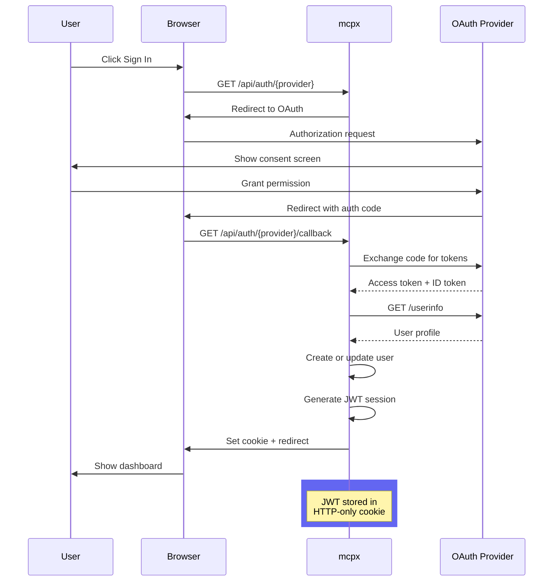
```mermaid
sequenceDiagram
    participant User
    participant Browser
    participant mcpx
    participant OAuth as OAuth Provider

    User->>Browser: Click Sign In
    Browser->>mcpx: GET /api/auth/{provider}
    mcpx->>Browser: Redirect to OAuth
    Browser->>OAuth: Authorization request
    OAuth->>User: Show consent screen
    User->>OAuth: Grant permission
    OAuth->>Browser: Redirect with auth code
    Browser->>mcpx: GET /api/auth/{provider}/callback
    mcpx->>OAuth: Exchange code for tokens
    OAuth-->>mcpx: Access token + ID token
    mcpx->>OAuth: GET /userinfo
    OAuth-->>mcpx: User profile
    mcpx->>mcpx: Create or update user
    mcpx->>mcpx: Generate JWT session
    mcpx->>Browser: Set cookie + redirect
    Browser->>User: Show dashboard

    rect rgb(99, 102, 241)
        Note over mcpx: JWT stored in<br/>HTTP-only cookie
    end
```

## Server Management

Servers represent external MCP endpoints that mcpx proxies requests to. Each server can have credentials and governance rules configured.

### Create Server

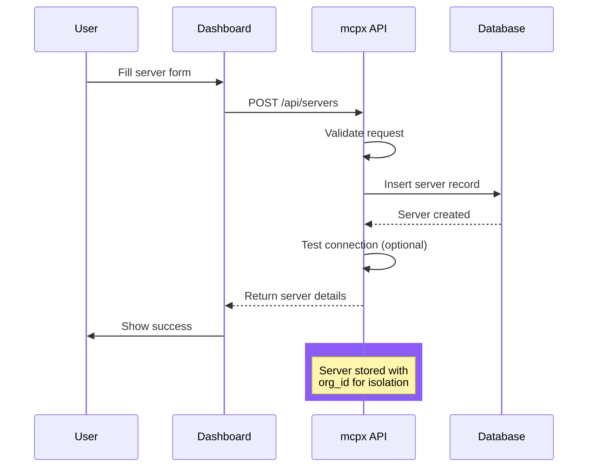
```mermaid
sequenceDiagram
    participant User
    participant Dashboard
    participant API as mcpx API
    participant DB as Database

    User->>Dashboard: Fill server form
    Dashboard->>API: POST /api/servers
    API->>API: Validate request
    API->>DB: Insert server record
    DB-->>API: Server created
    API->>API: Test connection (optional)
    API-->>Dashboard: Return server details
    Dashboard->>User: Show success

    rect rgb(139, 92, 246)
        Note over API: Server stored with<br/>org_id for isolation
    end
```

### Configure Credentials

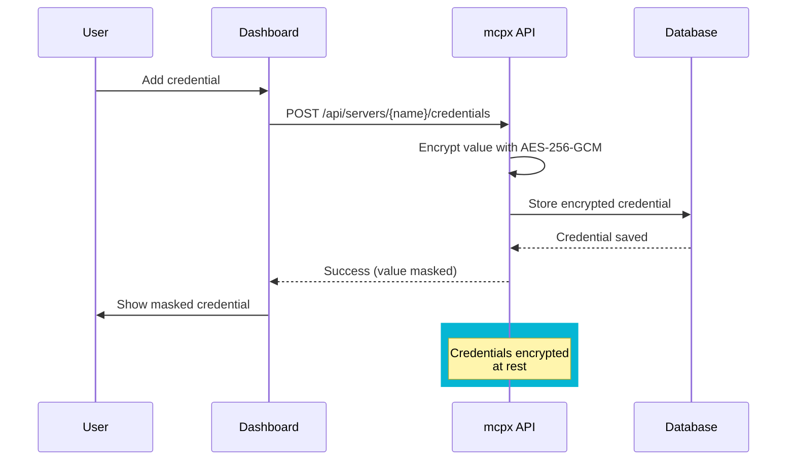
```mermaid
sequenceDiagram
    participant User
    participant Dashboard
    participant API as mcpx API
    participant DB as Database

    User->>Dashboard: Add credential
    Dashboard->>API: POST /api/servers/{name}/credentials
    API->>API: Encrypt value with AES-256-GCM
    API->>DB: Store encrypted credential
    DB-->>API: Credential saved
    API-->>Dashboard: Success (value masked)
    Dashboard->>User: Show masked credential

    rect rgb(6, 182, 212)
        Note over API: Credentials encrypted<br/>at rest
    end
```

## MCP Proxy Flow

The proxy layer handles all MCP traffic, injecting credentials and applying governance rules.

### Stateless Server Request

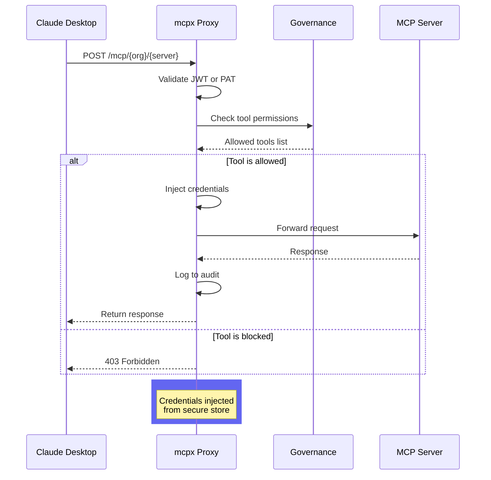
```mermaid
sequenceDiagram
    participant Client as Claude Desktop
    participant Proxy as mcpx Proxy
    participant Gov as Governance
    participant Server as MCP Server

    Client->>Proxy: POST /mcp/{org}/{server}
    Proxy->>Proxy: Validate JWT or PAT
    Proxy->>Gov: Check tool permissions
    Gov-->>Proxy: Allowed tools list

    alt Tool is allowed
        Proxy->>Proxy: Inject credentials
        Proxy->>Server: Forward request
        Server-->>Proxy: Response
        Proxy->>Proxy: Log to audit
        Proxy-->>Client: Return response
    else Tool is blocked
        Proxy-->>Client: 403 Forbidden
    end

    rect rgb(99, 102, 241)
        Note over Proxy: Credentials injected<br/>from secure store
    end
```

## Tool Governance

Governance rules control which tools AI agents can access on each server.

### Governance Evaluation

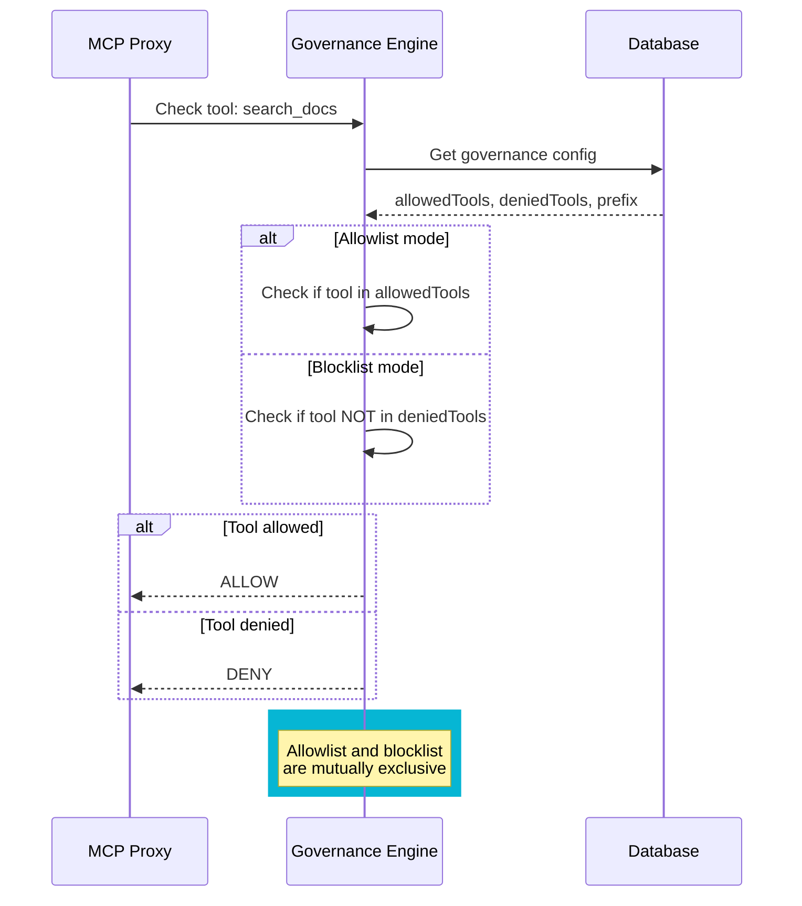
```mermaid
sequenceDiagram
    participant Proxy as MCP Proxy
    participant Gov as Governance Engine
    participant DB as Database

    Proxy->>Gov: Check tool: search_docs
    Gov->>DB: Get governance config
    DB-->>Gov: allowedTools, deniedTools, prefix

    alt Allowlist mode
        Gov->>Gov: Check if tool in allowedTools
    else Blocklist mode
        Gov->>Gov: Check if tool NOT in deniedTools
    end

    alt Tool allowed
        Gov-->>Proxy: ALLOW
    else Tool denied
        Gov-->>Proxy: DENY
    end

    rect rgb(6, 182, 212)
        Note over Gov: Allowlist and blocklist<br/>are mutually exclusive
    end
```

### Governance Configuration

| Mode | Behavior |
|------|----------|
| **Allowlist** | Only tools in the list are permitted |
| **Blocklist** | All tools permitted except those in the list |
| **No rules** | All tools are permitted |

## Virtual Gateways

Gateways aggregate multiple servers into a single endpoint, presenting a unified tool list.

### Gateway Tool Aggregation

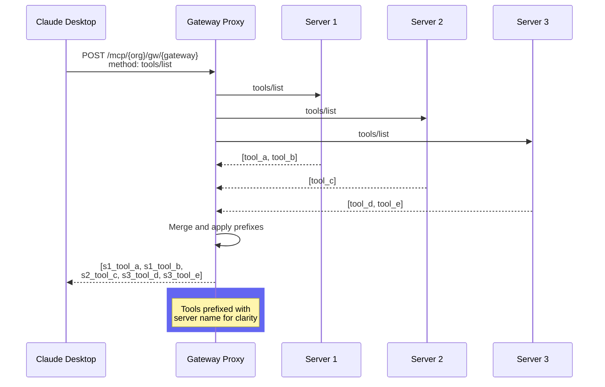
```mermaid
sequenceDiagram
    participant Client as Claude Desktop
    participant GW as Gateway Proxy
    participant S1 as Server 1
    participant S2 as Server 2
    participant S3 as Server 3

    Client->>GW: POST /mcp/{org}/gw/{gateway}<br/>method: tools/list
    GW->>S1: tools/list
    GW->>S2: tools/list
    GW->>S3: tools/list
    S1-->>GW: [tool_a, tool_b]
    S2-->>GW: [tool_c]
    S3-->>GW: [tool_d, tool_e]
    GW->>GW: Merge and apply prefixes
    GW-->>Client: [s1_tool_a, s1_tool_b,<br/>s2_tool_c, s3_tool_d, s3_tool_e]

    rect rgb(99, 102, 241)
        Note over GW: Tools prefixed with<br/>server name for clarity
    end
```

### Gateway Tool Call Routing

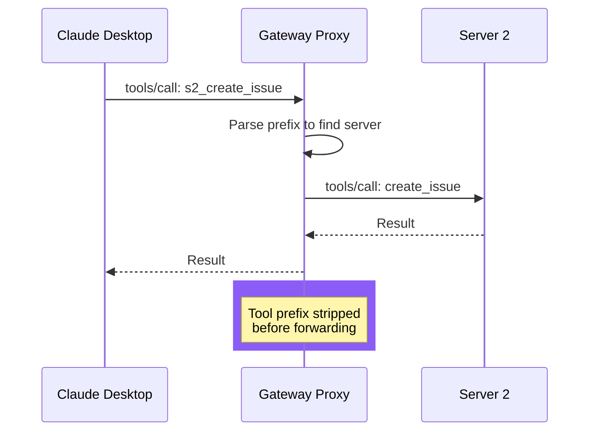
```mermaid
sequenceDiagram
    participant Client as Claude Desktop
    participant GW as Gateway Proxy
    participant S2 as Server 2

    Client->>GW: tools/call: s2_create_issue
    GW->>GW: Parse prefix to find server
    GW->>S2: tools/call: create_issue
    S2-->>GW: Result
    GW-->>Client: Result

    rect rgb(139, 92, 246)
        Note over GW: Tool prefix stripped<br/>before forwarding
    end
```

## Audit Logging

Every MCP request is logged with full details for compliance and debugging.

### Audit Log Capture

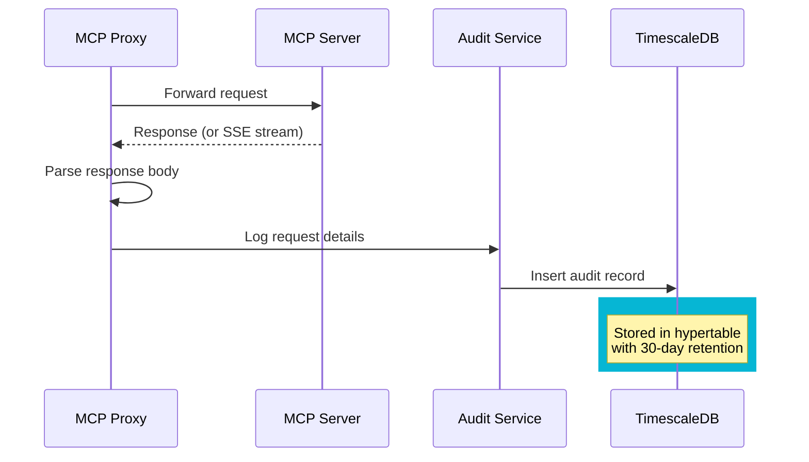
```mermaid
sequenceDiagram
    participant Proxy as MCP Proxy
    participant Target as MCP Server
    participant Audit as Audit Service
    participant DB as TimescaleDB

    Proxy->>Target: Forward request
    Target-->>Proxy: Response (or SSE stream)
    Proxy->>Proxy: Parse response body
    Proxy->>Audit: Log request details
    Audit->>DB: Insert audit record

    rect rgb(6, 182, 212)
        Note over DB: Stored in hypertable<br/>with 30-day retention
    end
```

### Logged Fields

| Field | Description |
|-------|-------------|
| timestamp | Request time |
| org_id | Organization identifier |
| user_id | Actor (user or service account) |
| server_id | Target server or gateway |
| method | MCP method (initialize, tools/list, tools/call) |
| tool_name | Tool name for tools/call requests |
| request_body | Full JSON-RPC request |
| response_body | Full response (SSE parsed) |
| latency_ms | Response time in milliseconds |
| status | Success or error |

## Metrics and Observability

Real-time metrics are collected using TimescaleDB for time-series storage.

### Metrics Collection

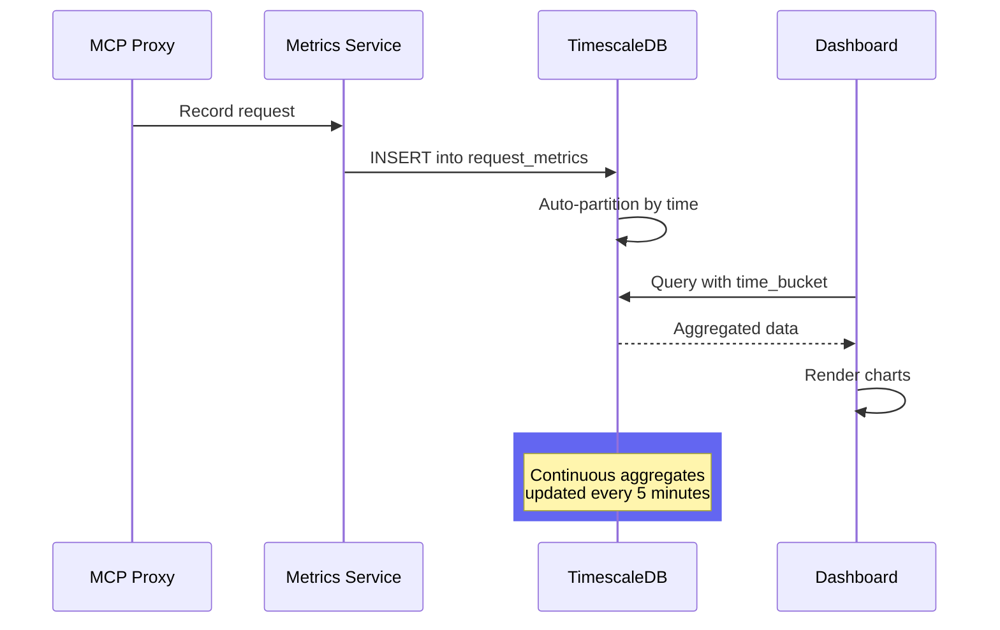
```mermaid
sequenceDiagram
    participant Proxy as MCP Proxy
    participant Metrics as Metrics Service
    participant DB as TimescaleDB
    participant Dashboard

    Proxy->>Metrics: Record request
    Metrics->>DB: INSERT into request_metrics
    DB->>DB: Auto-partition by time

    Dashboard->>DB: Query with time_bucket
    DB-->>Dashboard: Aggregated data
    Dashboard->>Dashboard: Render charts

    rect rgb(99, 102, 241)
        Note over DB: Continuous aggregates<br/>updated every 5 minutes
    end
```

### Available Metrics

| Metric | Description |
|--------|-------------|
| Request count | Total requests per time bucket |
| Latency (avg, p50, p95, p99, max) | Response time distribution |
| Error rate | Percentage of failed requests |
| Tool usage | Requests per tool name |

## Alerting

Background jobs evaluate alert rules and trigger notifications.

### Alert Evaluation

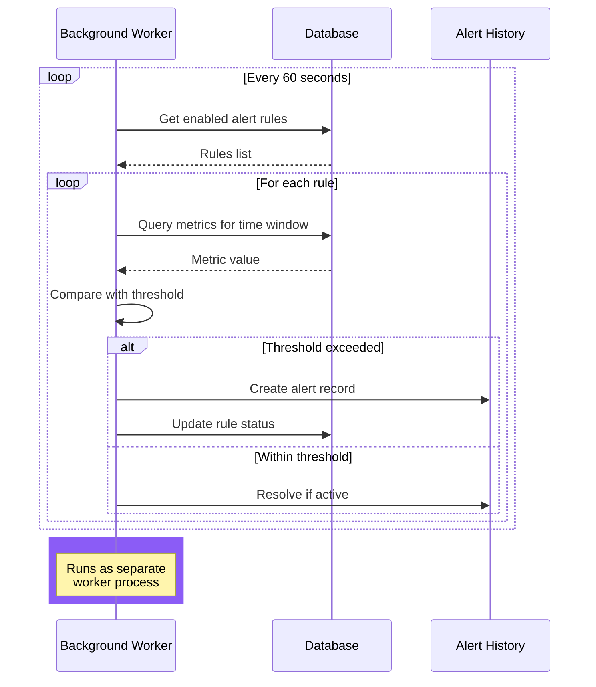
```mermaid
sequenceDiagram
    participant Worker as Background Worker
    participant DB as Database
    participant Alert as Alert History

    loop Every 60 seconds
        Worker->>DB: Get enabled alert rules
        DB-->>Worker: Rules list

        loop For each rule
            Worker->>DB: Query metrics for time window
            DB-->>Worker: Metric value
            Worker->>Worker: Compare with threshold

            alt Threshold exceeded
                Worker->>Alert: Create alert record
                Worker->>DB: Update rule status
            else Within threshold
                Worker->>Alert: Resolve if active
            end
        end
    end

    rect rgb(139, 92, 246)
        Note over Worker: Runs as separate<br/>worker process
    end
```

### Alert Rule Types

| Type | Description |
|------|-------------|
| **Threshold** | Triggers when metric exceeds or falls below value |
| **Spike** | Triggers on sudden changes from baseline |
| **No Data** | Triggers when no data received in time window |

## Rate Limiting

Per-server rate limits protect upstream servers from abuse.

### Rate Limit Enforcement

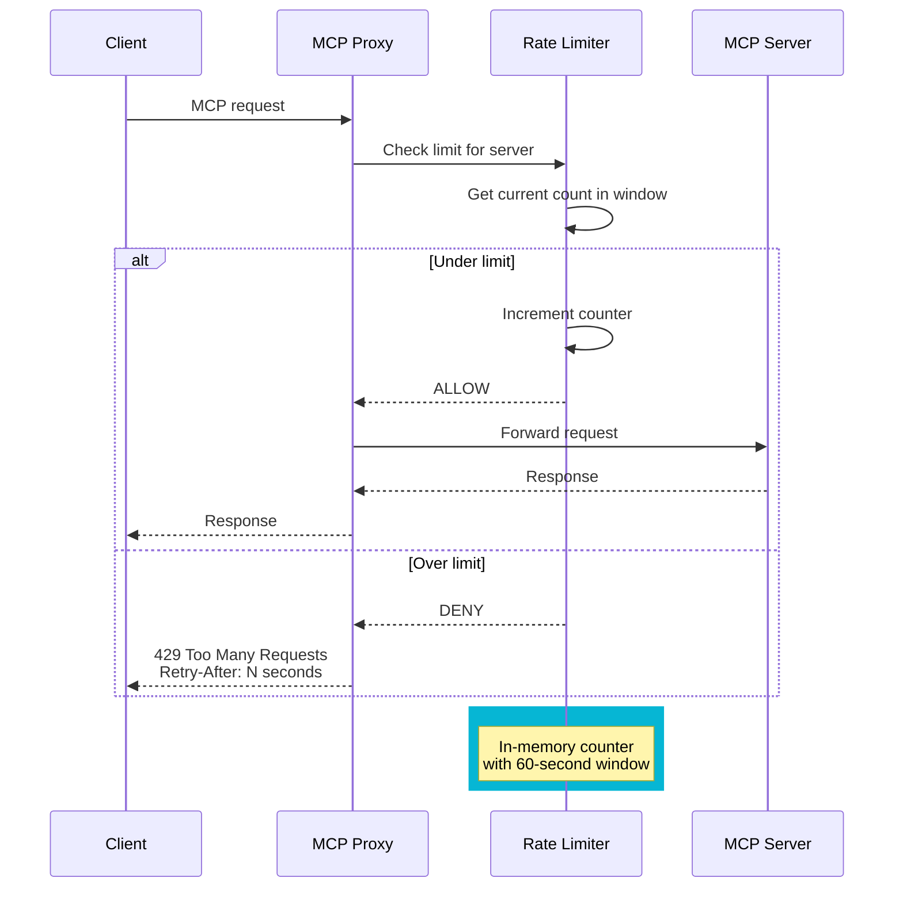
```mermaid
sequenceDiagram
    participant Client
    participant Proxy as MCP Proxy
    participant Limiter as Rate Limiter
    participant Server as MCP Server

    Client->>Proxy: MCP request
    Proxy->>Limiter: Check limit for server
    Limiter->>Limiter: Get current count in window

    alt Under limit
        Limiter->>Limiter: Increment counter
        Limiter-->>Proxy: ALLOW
        Proxy->>Server: Forward request
        Server-->>Proxy: Response
        Proxy-->>Client: Response
    else Over limit
        Limiter-->>Proxy: DENY
        Proxy-->>Client: 429 Too Many Requests<br/>Retry-After: N seconds
    end

    rect rgb(6, 182, 212)
        Note over Limiter: In-memory counter<br/>with 60-second window
    end
```

## Organization Management

Organizations provide multi-tenant isolation for resources.

### Create Organization

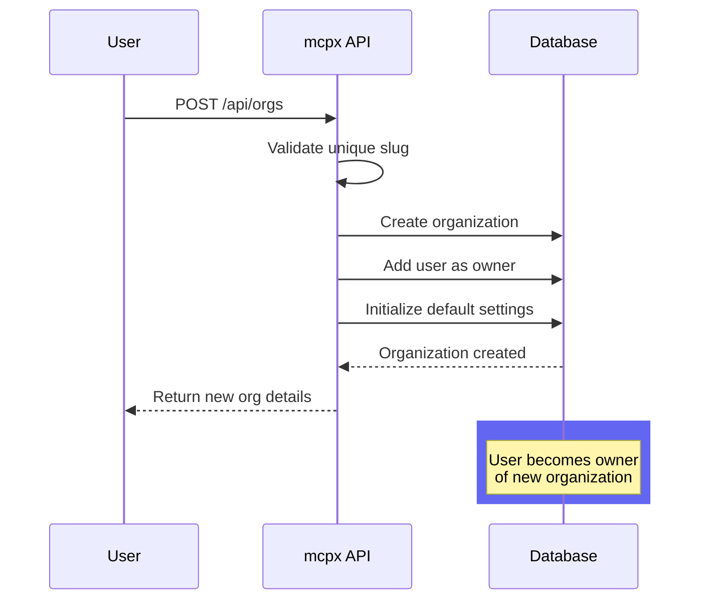
```mermaid
sequenceDiagram
    participant User
    participant API as mcpx API
    participant DB as Database

    User->>API: POST /api/orgs
    API->>API: Validate unique slug
    API->>DB: Create organization
    API->>DB: Add user as owner
    API->>DB: Initialize default settings
    DB-->>API: Organization created
    API-->>User: Return new org details

    rect rgb(99, 102, 241)
        Note over DB: User becomes owner<br/>of new organization
    end
```

### Invite Member

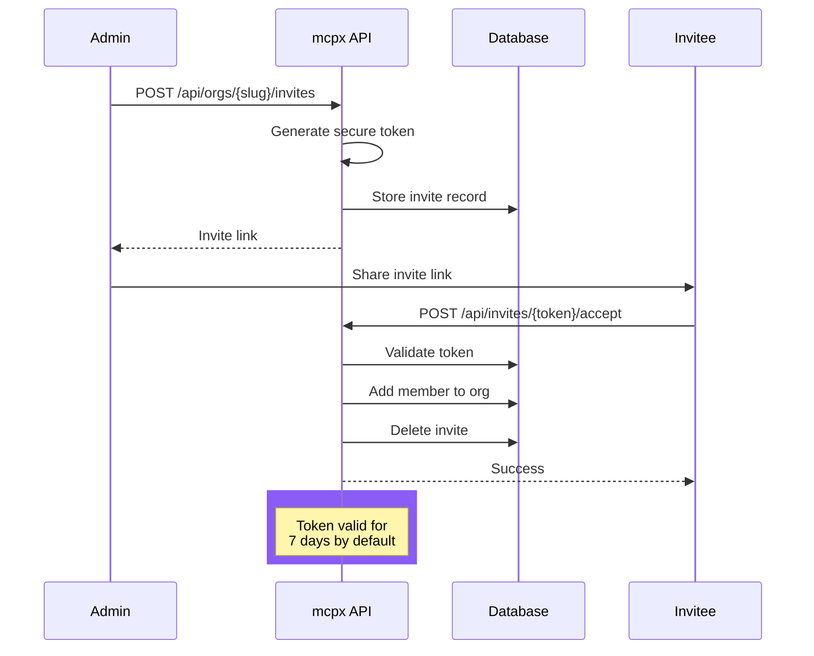
```mermaid
sequenceDiagram
    participant Admin
    participant API as mcpx API
    participant DB as Database
    participant Invitee

    Admin->>API: POST /api/orgs/{slug}/invites
    API->>API: Generate secure token
    API->>DB: Store invite record
    API-->>Admin: Invite link

    Admin->>Invitee: Share invite link
    Invitee->>API: POST /api/invites/{token}/accept
    API->>DB: Validate token
    API->>DB: Add member to org
    API->>DB: Delete invite
    API-->>Invitee: Success

    rect rgb(139, 92, 246)
        Note over API: Token valid for<br/>7 days by default
    end
```

## Personal Access Tokens

PATs enable programmatic access to mcpx APIs and MCP proxy.

### Create PAT

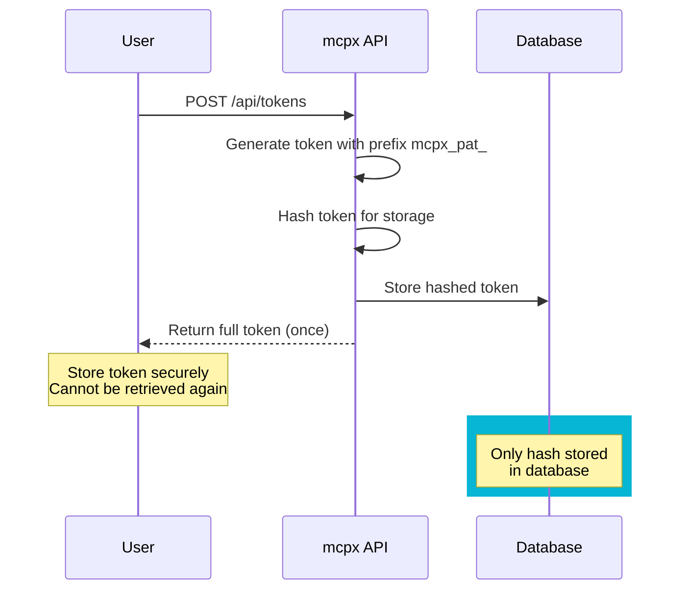
```mermaid
sequenceDiagram
    participant User
    participant API as mcpx API
    participant DB as Database

    User->>API: POST /api/tokens
    API->>API: Generate token with prefix mcpx_pat_
    API->>API: Hash token for storage
    API->>DB: Store hashed token
    API-->>User: Return full token (once)

    Note over User: Store token securely<br/>Cannot be retrieved again

    rect rgb(6, 182, 212)
        Note over DB: Only hash stored<br/>in database
    end
```

### Use PAT

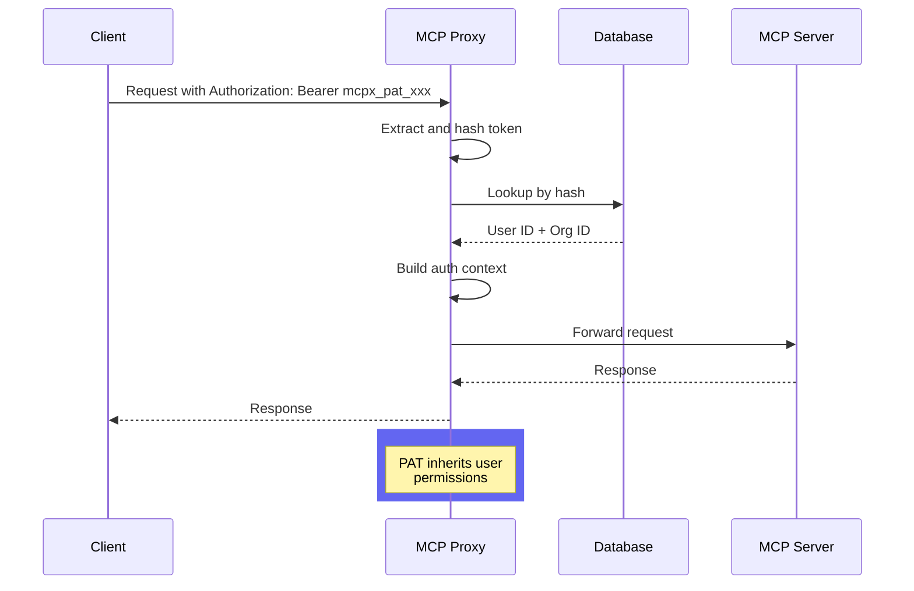
```mermaid
sequenceDiagram
    participant Client
    participant Proxy as MCP Proxy
    participant DB as Database
    participant Server as MCP Server

    Client->>Proxy: Request with Authorization: Bearer mcpx_pat_xxx
    Proxy->>Proxy: Extract and hash token
    Proxy->>DB: Lookup by hash
    DB-->>Proxy: User ID + Org ID
    Proxy->>Proxy: Build auth context
    Proxy->>Server: Forward request
    Server-->>Proxy: Response
    Proxy-->>Client: Response

    rect rgb(99, 102, 241)
        Note over Proxy: PAT inherits user<br/>permissions
    end
```

## Service Accounts

Service accounts enable machine-to-machine authentication using OAuth Client Credentials.

### Service Account Authentication

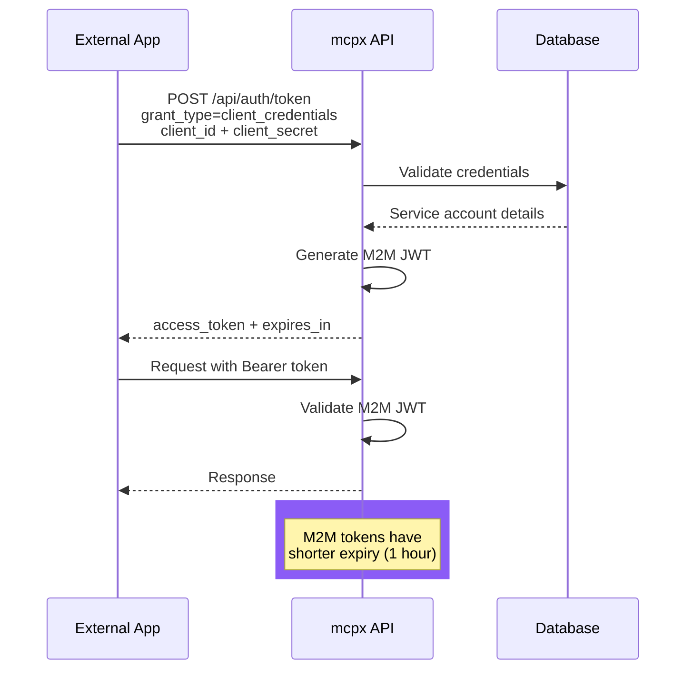
```mermaid
sequenceDiagram
    participant App as External App
    participant API as mcpx API
    participant DB as Database

    App->>API: POST /api/auth/token<br/>grant_type=client_credentials<br/>client_id + client_secret
    API->>DB: Validate credentials
    DB-->>API: Service account details
    API->>API: Generate M2M JWT
    API-->>App: access_token + expires_in

    App->>API: Request with Bearer token
    API->>API: Validate M2M JWT
    API-->>App: Response

    rect rgb(139, 92, 246)
        Note over API: M2M tokens have<br/>shorter expiry (1 hour)
    end
```

### Service Account Permissions

Service accounts have a role assigned at creation:

| Role | Capabilities |
|------|-------------|
| **Admin** | Full read/write access to organization resources |
| **Member** | Read-only access, limited to proxy operations |
