# mcpx - Product Specification

**Version:** 1.0
**Status:** Product Proposal
**Owner:** TM Dev Lab
**Last Updated:** 2025-12-17

---

## 📖 Table of Contents

### Product Specification
- [Executive Summary](#executive-summary)
- [Architecture](#architecture)
  - [High-Level Architecture](#high-level-architecture)
  - [Component Architecture](#component-architecture)
  - [Sequence Diagrams](#sequence-diagrams)
- [Database Schema](#database-schema)
- [API Reference](#api-reference)
- [Tool Governance Implementation](#tool-governance-implementation)
- [Virtual Gateway Session Aggregation](#virtual-gateway-session-aggregation)
- [MCP Transport Layer](#mcp-transport-layer)
  - [Session Management](#session-management-mcp-session-id)
  - [Streamable HTTP](#streamable-http-overview)
- [Popular MCP Servers for Testing](#popular-mcp-servers-for-testing)
- [Visual Identity](#visual-identity)
- [Implementation Roadmap](#implementation-roadmap)

### Related Documentation
- [Infrastructure & Deployment](./docs/INFRA.md) - K8s, Docker, deployment guide

---


# EXECUTIVE SUMMARY

## What is mcpx?

**mcpx (MCP eXtended Gateway)** is a production-ready SaaS platform for managing Model Context Protocol (MCP) servers at scale.

It bridges the gap between prototype and production by solving the hard problems: **multi-server orchestration**, **tool-level governance**, **secure credential management**, **complete observability**, and **team collaboration** — without requiring infrastructure expertise.

## Value Proposition

**"From Prototype to Production" — Solve the hard problems so you can focus on building**

Instead of struggling with infrastructure, teams:

- ✅ **Orchestrate** multiple MCP servers from a single dashboard

- ✅ **Govern** tool-level access (whitelist/blacklist specific capabilities)

- ✅ **Secure** credentials with enterprise-grade credential management

- ✅ **Observe** every request with complete audit logs and analytics

- ✅ **Collaborate** with team workspaces and role-based access control
- ✅ **Connect** via virtual gateways (one endpoint for all your servers)

## Target Market

### Primary (Phase 1)
- **AI Application Developers:** Building with Claude Desktop, GPT-4, LLMs
- **Product Teams:** Product Managers and designers integrating AI into workflows
- **AI Enthusiasts:** Power users experimenting with custom AI tools
- **Startups:** Validating AI products, need fast iteration without infrastructure overhead
- **Independent Developers:** Solo builders needing quick MCP integration

### Secondary (Phase 2+)
- **Engineering Teams:** Multi-user organizations requiring collaboration and SSO
- **Business Analysts:** Non-technical users leveraging AI tools for data analysis
- **Enterprises:** Large organizations needing compliance, audit trails, and fine-grained governance
- **Education:** Universities and bootcamps teaching AI development

## Key Differentiators

1. **Web-First Experience:** No CLI, no YAML, no infrastructure knowledge required
2. **Proxy Architecture:** Connect to existing servers, no re-deployment or migration needed
3. **SaaS Model:** No self-hosting required, instant setup, automatic updates
4. **Built-in Governance:** Tool-level control, not just server-level access management
5. **Virtual Gateways:** Aggregate N servers, single endpoint for Claude Desktop
6. **Production-Ready:** Enterprise-grade reliability, security, and observability from day one

## Success Metrics (Phase 1 - 4 weeks)

**User Acquisition:**
- 25+ developer sign-ups
- 10+ active users (weekly)

**Platform Usage:**
- 15+ MCP servers configured
- 500+ MCP requests/week
- 3+ virtual gateways created

**Validation:**
- 80%+ positive feedback (surveys)
- 5+ feature requests documented
- 0 critical security issues

---

# ARCHITECTURE

## High-Level Architecture

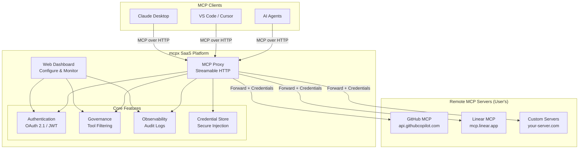
```mermaid
graph TB
    subgraph "MCP Clients"
        CD[Claude Desktop]
        VS[VS Code / Cursor]
        Agent[AI Agents]
    end

    subgraph "mcpx SaaS Platform"
        Dashboard[Web Dashboard<br/>Configure & Monitor]
        Proxy[MCP Proxy<br/>Streamable HTTP]
        
        subgraph "Core Features"
            Auth[Authentication<br/>OAuth 2.1 / JWT]
            Gov[Governance<br/>Tool Filtering]
            Audit[Observability<br/>Audit Logs]
            Creds[Credential Store<br/>Secure Injection]
        end
    end

    subgraph "Remote MCP Servers (User's)"
        GH[GitHub MCP<br/>api.githubcopilot.com]
        Lin[Linear MCP<br/>mcp.linear.app]
        Custom[Custom Servers<br/>your-server.com]
    end

    CD -->|MCP over HTTP| Proxy
    VS -->|MCP over HTTP| Proxy
    Agent -->|MCP over HTTP| Proxy

    Dashboard --> Auth
    Dashboard --> Gov
    Dashboard --> Audit

    Proxy --> Auth
    Proxy --> Gov
    Proxy --> Audit
    Proxy --> Creds

    Proxy -->|Forward + Credentials| GH
    Proxy -->|Forward + Credentials| Lin
    Proxy -->|Forward + Credentials| Custom
```

## Component Architecture

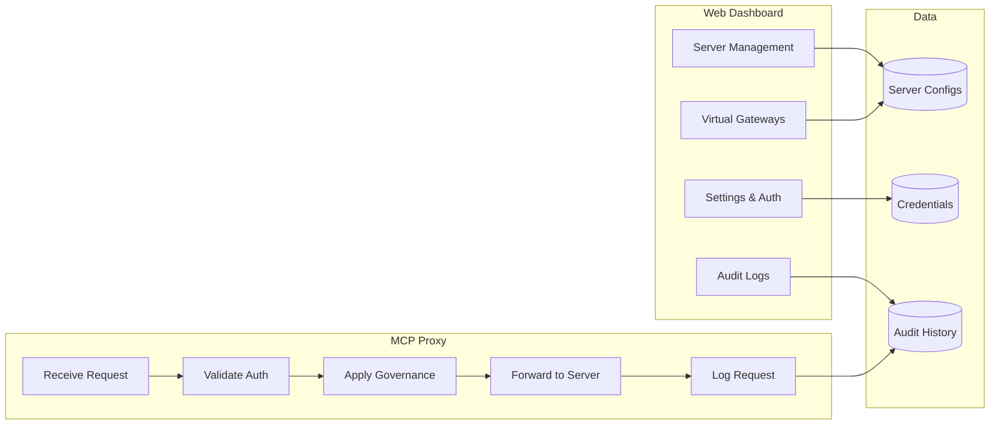
```mermaid
graph LR
    subgraph "Web Dashboard"
        Servers[Server Management]
        Gateways[Virtual Gateways]
        Logs[Audit Logs]
        Settings[Settings & Auth]
    end

    subgraph "MCP Proxy"
        Receive[Receive Request]
        Validate[Validate Auth]
        Filter[Apply Governance]
        Forward[Forward to Server]
        Log[Log Request]
    end

    subgraph "Data"
        Config[(Server Configs)]
        Creds[(Credentials)]
        AuditDB[(Audit History)]
    end

    Servers --> Config
    Gateways --> Config
    Settings --> Creds
    Logs --> AuditDB

    Receive --> Validate
    Validate --> Filter
    Filter --> Forward
    Forward --> Log
    Log --> AuditDB
```

## Data Flow Overview

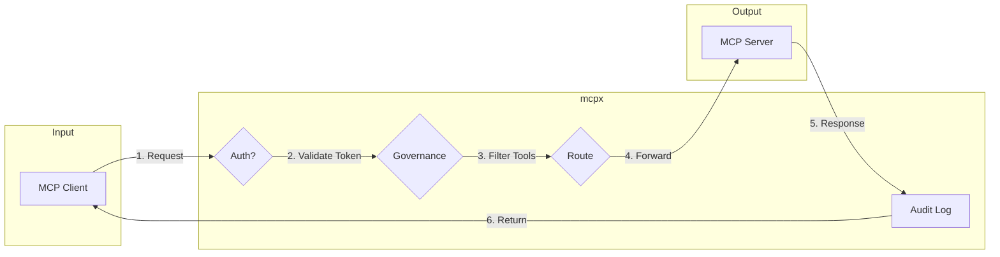
```mermaid
flowchart LR
    subgraph Input
        Client[MCP Client]
    end

    subgraph mcpx
        Auth{Auth?}
        Gov{Governance}
        Route{Route}
        Log[Audit Log]
    end

    subgraph Output
        Server[MCP Server]
    end

    Client -->|1. Request| Auth
    Auth -->|2. Validate Token| Gov
    Gov -->|3. Filter Tools| Route
    Route -->|4. Forward| Server
    Server -->|5. Response| Log
    Log -->|6. Return| Client
```

---

## Sequence Diagrams

### 1. User Authentication (OAuth 2.1)

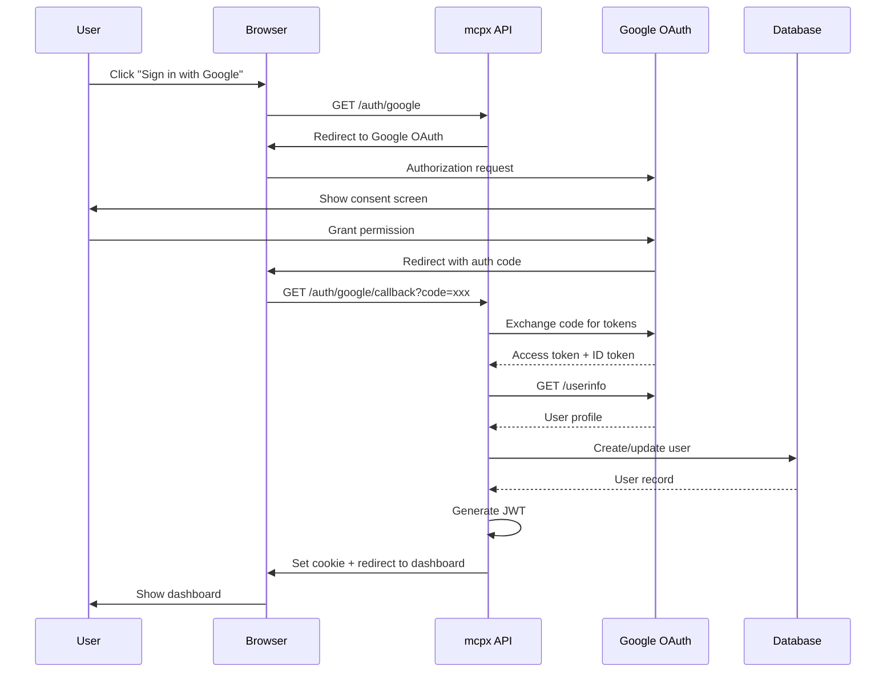
```mermaid
sequenceDiagram
    participant User
    participant Browser
    participant mcpx API
    participant Google OAuth
    participant Database

    User->>Browser: Click "Sign in with Google"
    Browser->>mcpx API: GET /auth/google
    mcpx API->>Browser: Redirect to Google OAuth
    Browser->>Google OAuth: Authorization request
    Google OAuth->>User: Show consent screen
    User->>Google OAuth: Grant permission
    Google OAuth->>Browser: Redirect with auth code
    Browser->>mcpx API: GET /auth/google/callback?code=xxx
    mcpx API->>Google OAuth: Exchange code for tokens
    Google OAuth-->>mcpx API: Access token + ID token
    mcpx API->>Google OAuth: GET /userinfo
    Google OAuth-->>mcpx API: User profile
    mcpx API->>Database: Create/update user
    Database-->>mcpx API: User record
    mcpx API->>mcpx API: Generate JWT
    mcpx API->>Browser: Set cookie + redirect to dashboard
    Browser->>User: Show dashboard
```

### 2. MCP Proxy Flow (Stateless Server)

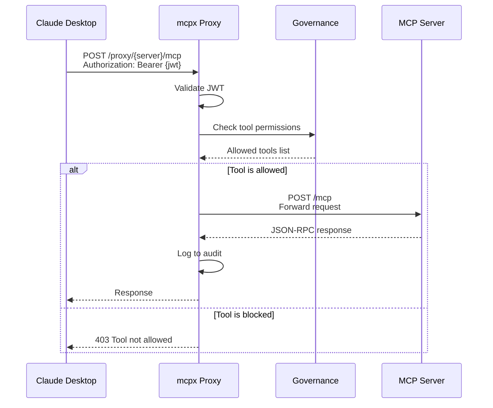
```mermaid
sequenceDiagram
    participant Client as Claude Desktop
    participant mcpx as mcpx Proxy
    participant Gov as Governance
    participant Server as MCP Server

    Client->>mcpx: POST /proxy/{server}/mcp<br/>Authorization: Bearer {jwt}
    mcpx->>mcpx: Validate JWT
    mcpx->>Gov: Check tool permissions
    Gov-->>mcpx: Allowed tools list
    
    alt Tool is allowed
        mcpx->>Server: POST /mcp<br/>Forward request
        Server-->>mcpx: JSON-RPC response
        mcpx->>mcpx: Log to audit
        mcpx-->>Client: Response
    else Tool is blocked
        mcpx-->>Client: 403 Tool not allowed
    end
```

### 3. MCP Proxy Flow (Stateful Server with Session)

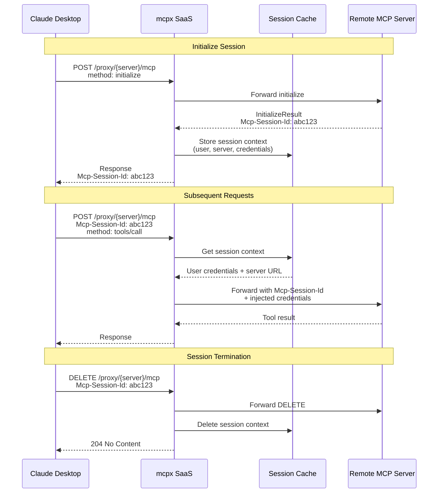
```mermaid
sequenceDiagram
    participant Client as Claude Desktop
    participant mcpx as mcpx SaaS
    participant Cache as Session Cache
    participant Server as Remote MCP Server

    Note over Client,Server: Initialize Session
    Client->>mcpx: POST /proxy/{server}/mcp<br/>method: initialize
    mcpx->>Server: Forward initialize
    Server-->>mcpx: InitializeResult<br/>Mcp-Session-Id: abc123
    mcpx->>Cache: Store session context<br/>(user, server, credentials)
    mcpx-->>Client: Response<br/>Mcp-Session-Id: abc123

    Note over Client,Server: Subsequent Requests
    Client->>mcpx: POST /proxy/{server}/mcp<br/>Mcp-Session-Id: abc123<br/>method: tools/call
    mcpx->>Cache: Get session context
    Cache-->>mcpx: User credentials + server URL
    mcpx->>Server: Forward with Mcp-Session-Id<br/>+ injected credentials
    Server-->>mcpx: Tool result
    mcpx-->>Client: Response

    Note over Client,Server: Session Termination
    Client->>mcpx: DELETE /proxy/{server}/mcp<br/>Mcp-Session-Id: abc123
    mcpx->>Server: Forward DELETE
    mcpx->>Cache: Delete session context
    mcpx-->>Client: 204 No Content
```

---

# DATABASE SCHEMA

> **Database:** PostgreSQL 15+  
> **ORM:** SQLx (Rust) with compile-time query verification

## Entity Relationship Diagram

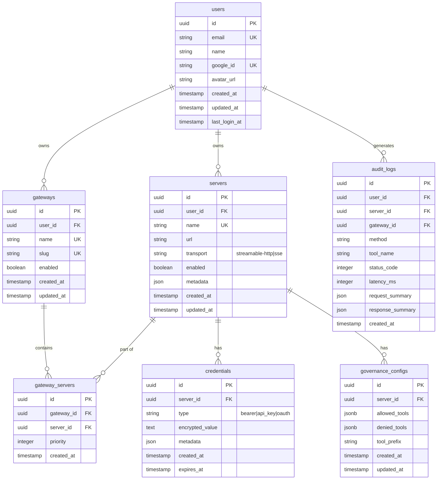
```mermaid
erDiagram
    users ||--o{ servers : owns
    users ||--o{ gateways : owns
    users ||--o{ audit_logs : generates
    gateways ||--o{ gateway_servers : contains
    servers ||--o{ gateway_servers : "part of"
    servers ||--o{ credentials : has
    servers ||--o{ governance_configs : has

    users {
        uuid id PK
        string email UK
        string name
        string google_id UK
        string avatar_url
        timestamp created_at
        timestamp updated_at
        timestamp last_login_at
    }

    servers {
        uuid id PK
        uuid user_id FK
        string name UK
        string url
        string transport "streamable-http|sse"
        boolean enabled
        json metadata
        timestamp created_at
        timestamp updated_at
    }

    credentials {
        uuid id PK
        uuid server_id FK
        string type "bearer|api_key|oauth"
        text encrypted_value
        json metadata
        timestamp created_at
        timestamp expires_at
    }

    governance_configs {
        uuid id PK
        uuid server_id FK
        jsonb allowed_tools
        jsonb denied_tools
        string tool_prefix
        timestamp created_at
        timestamp updated_at
    }

    gateways {
        uuid id PK
        uuid user_id FK
        string name UK
        string slug UK
        boolean enabled
        timestamp created_at
        timestamp updated_at
    }

    gateway_servers {
        uuid id PK
        uuid gateway_id FK
        uuid server_id FK
        integer priority
        timestamp created_at
    }

    audit_logs {
        uuid id PK
        uuid user_id FK
        uuid server_id FK
        uuid gateway_id FK
        string method
        string tool_name
        integer status_code
        integer latency_ms
        json request_summary
        json response_summary
        timestamp created_at
    }
```

## SQL Migrations

### 001_users.sql

```sql
CREATE TABLE users (
    id UUID PRIMARY KEY DEFAULT gen_random_uuid(),
    email VARCHAR(255) NOT NULL UNIQUE,
    name VARCHAR(255),
    google_id VARCHAR(255) UNIQUE,
    avatar_url TEXT,
    created_at TIMESTAMPTZ NOT NULL DEFAULT NOW(),
    updated_at TIMESTAMPTZ NOT NULL DEFAULT NOW(),
    last_login_at TIMESTAMPTZ
);

CREATE INDEX idx_users_email ON users(email);
CREATE INDEX idx_users_google_id ON users(google_id);
```

### 002_servers.sql

```sql
CREATE TABLE servers (
    id UUID PRIMARY KEY DEFAULT gen_random_uuid(),
    user_id UUID NOT NULL REFERENCES users(id) ON DELETE CASCADE,
    name VARCHAR(255) NOT NULL,
    url TEXT NOT NULL,
    transport VARCHAR(50) NOT NULL DEFAULT 'streamable-http',
    enabled BOOLEAN NOT NULL DEFAULT true,
    metadata JSONB DEFAULT '{}',
    created_at TIMESTAMPTZ NOT NULL DEFAULT NOW(),
    updated_at TIMESTAMPTZ NOT NULL DEFAULT NOW(),
    
    UNIQUE(user_id, name)
);

CREATE INDEX idx_servers_user_id ON servers(user_id);
```

### 003_credentials.sql

```sql
CREATE TABLE credentials (
    id UUID PRIMARY KEY DEFAULT gen_random_uuid(),
    server_id UUID NOT NULL REFERENCES servers(id) ON DELETE CASCADE,
    type VARCHAR(50) NOT NULL, -- 'bearer', 'api_key', 'oauth'
    encrypted_value TEXT NOT NULL,
    metadata JSONB DEFAULT '{}',
    created_at TIMESTAMPTZ NOT NULL DEFAULT NOW(),
    expires_at TIMESTAMPTZ
);

CREATE INDEX idx_credentials_server_id ON credentials(server_id);
```

### 004_governance.sql

```sql
CREATE TABLE governance_configs (
    id UUID PRIMARY KEY DEFAULT gen_random_uuid(),
    server_id UUID NOT NULL UNIQUE REFERENCES servers(id) ON DELETE CASCADE,
    allowed_tools JSONB DEFAULT '[]',
    denied_tools JSONB DEFAULT '[]',
    tool_prefix VARCHAR(50) DEFAULT '',
    created_at TIMESTAMPTZ NOT NULL DEFAULT NOW(),
    updated_at TIMESTAMPTZ NOT NULL DEFAULT NOW(),
    
    CONSTRAINT check_mutually_exclusive 
        CHECK (
            (jsonb_array_length(allowed_tools) = 0) OR 
            (jsonb_array_length(denied_tools) = 0)
        )
);
```

### 005_gateways.sql

```sql
CREATE TABLE gateways (
    id UUID PRIMARY KEY DEFAULT gen_random_uuid(),
    user_id UUID NOT NULL REFERENCES users(id) ON DELETE CASCADE,
    name VARCHAR(255) NOT NULL,
    slug VARCHAR(100) NOT NULL,
    enabled BOOLEAN NOT NULL DEFAULT true,
    created_at TIMESTAMPTZ NOT NULL DEFAULT NOW(),
    updated_at TIMESTAMPTZ NOT NULL DEFAULT NOW(),
    
    UNIQUE(user_id, name),
    UNIQUE(user_id, slug)
);

CREATE TABLE gateway_servers (
    id UUID PRIMARY KEY DEFAULT gen_random_uuid(),
    gateway_id UUID NOT NULL REFERENCES gateways(id) ON DELETE CASCADE,
    server_id UUID NOT NULL REFERENCES servers(id) ON DELETE CASCADE,
    priority INTEGER NOT NULL DEFAULT 0,
    created_at TIMESTAMPTZ NOT NULL DEFAULT NOW(),
    
    UNIQUE(gateway_id, server_id)
);

CREATE INDEX idx_gateway_servers_gateway_id ON gateway_servers(gateway_id);
```

### 006_audit_logs.sql

```sql
CREATE TABLE audit_logs (
    id UUID PRIMARY KEY DEFAULT gen_random_uuid(),
    user_id UUID NOT NULL REFERENCES users(id),
    server_id UUID REFERENCES servers(id) ON DELETE SET NULL,
    gateway_id UUID REFERENCES gateways(id) ON DELETE SET NULL,
    method VARCHAR(100) NOT NULL,
    tool_name VARCHAR(255),
    status_code INTEGER NOT NULL,
    latency_ms INTEGER NOT NULL,
    request_summary JSONB,
    response_summary JSONB,
    created_at TIMESTAMPTZ NOT NULL DEFAULT NOW()
);

-- Partition by month for performance
CREATE INDEX idx_audit_logs_user_id ON audit_logs(user_id);
CREATE INDEX idx_audit_logs_created_at ON audit_logs(created_at);
CREATE INDEX idx_audit_logs_server_id ON audit_logs(server_id);
```

### 007_request_metrics.sql (TimescaleDB)

> **Requires:** TimescaleDB extension enabled in PostgreSQL

```sql
-- Enable TimescaleDB
CREATE EXTENSION IF NOT EXISTS timescaledb;

-- Request metrics hypertable (time-series data)
CREATE TABLE request_metrics (
    time TIMESTAMPTZ NOT NULL,
    user_id UUID NOT NULL,
    target_type VARCHAR(10) NOT NULL,  -- 'server' or 'gateway'
    target_id UUID NOT NULL,
    target_name VARCHAR(255) NOT NULL,
    method VARCHAR(50),
    latency_ms INT,
    success BOOLEAN NOT NULL DEFAULT true
);

-- Convert to hypertable (auto-partitioned by time)
SELECT create_hypertable('request_metrics', 'time');

CREATE INDEX idx_metrics_user_time ON request_metrics (user_id, time DESC);
CREATE INDEX idx_metrics_target_time ON request_metrics (target_id, time DESC);

-- Retention policy: 90 days for raw data
SELECT add_retention_policy('request_metrics', INTERVAL '90 days');

-- Continuous aggregate: hourly stats (auto-updated every hour)
CREATE MATERIALIZED VIEW request_metrics_hourly
WITH (timescaledb.continuous) AS
SELECT 
    time_bucket('1 hour', time) AS bucket,
    user_id, target_type, target_id, target_name,
    COUNT(*) AS total,
    COUNT(*) FILTER (WHERE success) AS success_count,
    AVG(latency_ms)::INT AS avg_latency_ms
FROM request_metrics
GROUP BY bucket, user_id, target_type, target_id, target_name
WITH NO DATA;
```

---

# API REFERENCE

> **Base URL:** `https://mcpx.app/api` (production) or `http://localhost:8080/api` (local)  
> **Authentication:** Bearer JWT token (from OAuth flow)

## Authentication

| Method | Endpoint | Description |
|--------|----------|-------------|
| `GET` | `/auth/google` | Redirect to Google OAuth |
| `GET` | `/auth/google/callback` | OAuth callback (sets JWT cookie) |
| `POST` | `/auth/logout` | Clear session and JWT |
| `GET` | `/auth/me` | Get current user info |

### Example: Get Current User

```bash
curl -H "Authorization: Bearer $TOKEN" https://mcpx.app/api/auth/me
```

```json
{
  "id": "550e8400-e29b-41d4-a716-446655440000",
  "email": "user@example.com",
  "name": "John Doe",
  "avatarUrl": "https://lh3.googleusercontent.com/..."
}
```

## Servers

| Method | Endpoint | Description |
|--------|----------|-------------|
| `GET` | `/servers` | List all servers |
| `POST` | `/servers` | Create new server |
| `GET` | `/servers/{name}` | Get server by name |
| `PUT` | `/servers/{name}` | Update server |
| `DELETE` | `/servers/{name}` | Delete server |
| `GET` | `/servers/{name}/tools` | List tools (with governance applied) |
| `POST` | `/servers/{name}/test` | Test server connectivity |

### Create Server

```bash
curl -X POST -H "Authorization: Bearer $TOKEN" \
  -H "Content-Type: application/json" \
  -d '{
    "name": "github",
    "url": "https://api.githubcopilot.com/mcp",
    "transport": "streamable-http"
  }' \
  https://mcpx.app/api/servers
```

### Response

```json
{
  "id": "550e8400-e29b-41d4-a716-446655440001",
  "name": "github",
  "url": "https://api.githubcopilot.com/mcp",
  "transport": "streamable-http",
  "enabled": true,
  "createdAt": "2024-01-15T10:30:00Z"
}
```

## Credentials

| Method | Endpoint | Description |
|--------|----------|-------------|
| `GET` | `/servers/{name}/credentials` | List credentials (masked) |
| `POST` | `/servers/{name}/credentials` | Add credential |
| `DELETE` | `/servers/{name}/credentials/{id}` | Delete credential |

### Add Credential

```bash
curl -X POST -H "Authorization: Bearer $TOKEN" \
  -H "Content-Type: application/json" \
  -d '{
    "type": "bearer",
    "value": "ghp_xxxxxxxxxxxx"
  }' \
  https://mcpx.app/api/servers/github/credentials
```

## Governance

| Method | Endpoint | Description |
|--------|----------|-------------|
| `GET` | `/servers/{name}/governance` | Get governance config |
| `POST` | `/servers/{name}/governance` | Set/update governance |
| `DELETE` | `/servers/{name}/governance` | Clear governance (allow all) |

### Set Governance

```bash
curl -X POST -H "Authorization: Bearer $TOKEN" \
  -H "Content-Type: application/json" \
  -d '{
    "allowedTools": ["create_issue", "list_repos"],
    "deniedTools": [],
    "toolPrefix": "gh"
  }' \
  https://mcpx.app/api/servers/github/governance
```

## Virtual Gateways

| Method | Endpoint | Description |
|--------|----------|-------------|
| `GET` | `/gateways` | List all gateways |
| `POST` | `/gateways` | Create new gateway |
| `GET` | `/gateways/{slug}` | Get gateway by slug |
| `PUT` | `/gateways/{slug}` | Update gateway |
| `DELETE` | `/gateways/{slug}` | Delete gateway |
| `POST` | `/gateways/{slug}/servers` | Add server to gateway |
| `DELETE` | `/gateways/{slug}/servers/{name}` | Remove server from gateway |

### Create Gateway

```bash
curl -X POST -H "Authorization: Bearer $TOKEN" \
  -H "Content-Type: application/json" \
  -d '{
    "name": "My Dev Gateway",
    "slug": "dev",
    "servers": ["github", "linear", "slack"]
  }' \
  https://mcpx.app/api/gateways
```

### Response

```json
{
  "id": "550e8400-e29b-41d4-a716-446655440002",
  "name": "My Dev Gateway",
  "slug": "dev",
  "enabled": true,
  "proxyUrl": "https://mcpx.app/mcp/user-id/dev",
  "servers": [
    { "name": "github", "priority": 0 },
    { "name": "linear", "priority": 1 },
    { "name": "slack", "priority": 2 }
  ]
}
```

## MCP Proxy

| Method | Endpoint | Description |
|--------|----------|-------------|
| `POST` | `/mcp/{user}/{server}` | Proxy to single server |
| `POST` | `/mcp/{user}/{gateway}` | Proxy to virtual gateway |
| `DELETE` | `/mcp/{user}/{server}` | Terminate session |

### MCP Request/Response Flow

```bash
# Initialize session
curl -X POST -H "Content-Type: application/json" \
  -d '{
    "jsonrpc": "2.0",
    "id": 1,
    "method": "initialize",
    "params": { "protocolVersion": "2024-11-05" }
  }' \
  https://mcpx.app/mcp/user-id/github
```

## Audit Logs

| Method | Endpoint | Description |
|--------|----------|-------------|
| `GET` | `/audit` | List audit logs (paginated) |
| `GET` | `/audit/stats` | Get usage statistics |

### Query Parameters

| Param | Type | Description |
|-------|------|-------------|
| `server` | string | Filter by server name |
| `gateway` | string | Filter by gateway slug |
| `method` | string | Filter by MCP method |
| `from` | ISO8601 | Start date |
| `to` | ISO8601 | End date |
| `limit` | int | Max results (default 50) |
| `offset` | int | Pagination offset |

### Example

```bash
curl -H "Authorization: Bearer $TOKEN" \
  "https://mcpx.app/api/audit?server=github&limit=10"
```

---

### 4. Tool Governance Flow

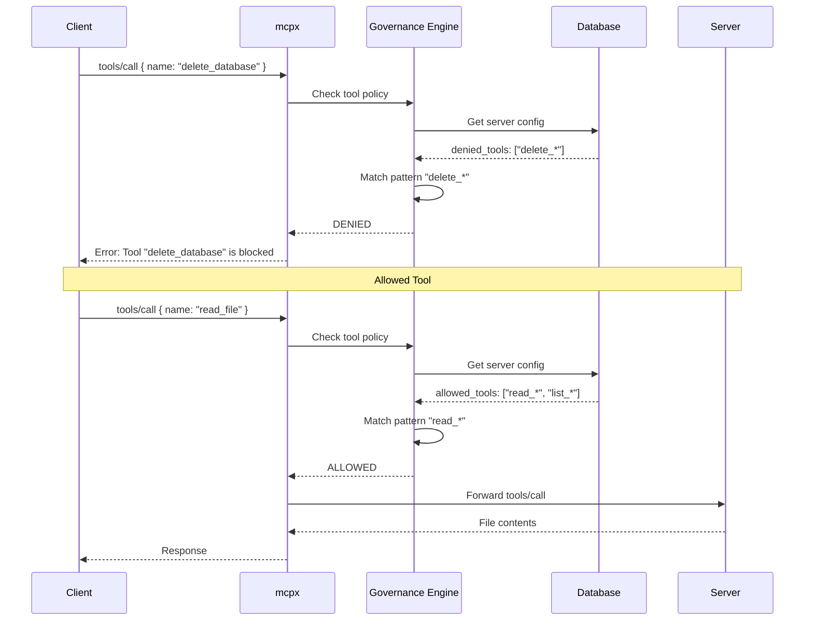
```mermaid
sequenceDiagram
    participant Client
    participant mcpx
    participant Gov as Governance Engine
    participant DB as Database
    participant Server

    Client->>mcpx: tools/call { name: "delete_database" }
    mcpx->>Gov: Check tool policy
    Gov->>DB: Get server config
    DB-->>Gov: denied_tools: ["delete_*"]
    Gov->>Gov: Match pattern "delete_*"
    Gov-->>mcpx: DENIED

    mcpx-->>Client: Error: Tool "delete_database" is blocked

    Note over Client,Server: Allowed Tool
    Client->>mcpx: tools/call { name: "read_file" }
    mcpx->>Gov: Check tool policy
    Gov->>DB: Get server config
    DB-->>Gov: allowed_tools: ["read_*", "list_*"]
    Gov->>Gov: Match pattern "read_*"
    Gov-->>mcpx: ALLOWED

    mcpx->>Server: Forward tools/call
    Server-->>mcpx: File contents
    mcpx-->>Client: Response
```

### 4.1 Tool Governance Implementation

> **Purpose**: Control which tools are exposed to clients and how they are named.

#### Data Model

```typescript
interface ToolGovernanceConfig {
  serverName: string;                // Server this config applies to
  allowedTools: string[];            // Whitelist: ONLY these tools exposed (empty = all)
  deniedTools: string[];             // Blacklist: these tools hidden
  toolPrefix: string;                // Prefix added to tool names (e.g., "gh" → "gh_get_weather")
  createdAt: string;
  updatedAt: string;
}

// Validation rules:
// - allowedTools and deniedTools are MUTUALLY EXCLUSIVE (cannot use both)
// - toolPrefix must be alphanumeric + underscore only (no spaces)
```

#### Filtering Algorithm

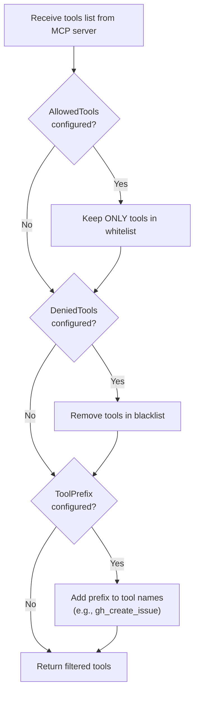
```mermaid
flowchart TD
    Start[Receive tools list from MCP server] --> CheckWhitelist{AllowedTools<br/>configured?}
    
    CheckWhitelist -->|Yes| ApplyWhitelist[Keep ONLY tools in whitelist]
    CheckWhitelist -->|No| ApplyBlacklist
    
    ApplyWhitelist --> ApplyBlacklist{DeniedTools<br/>configured?}
    
    ApplyBlacklist -->|Yes| RemoveDenied[Remove tools in blacklist]
    ApplyBlacklist -->|No| ApplyPrefix
    
    RemoveDenied --> ApplyPrefix{ToolPrefix<br/>configured?}
    
    ApplyPrefix -->|Yes| AddPrefix["Add prefix to tool names<br/>(e.g., gh_create_issue)"]
    ApplyPrefix -->|No| Return
    
    AddPrefix --> Return[Return filtered tools]
```

#### Filtering Logic (Pseudocode)

```python
def filter_tools(server_name: str, tools: List[Tool]) -> List[Tool]:
    config = get_governance_config(server_name)
    
    # No config = no filtering (all tools exposed)
    if config is None:
        return tools
    
    filtered = []
    for tool in tools:
        # Step 1: Apply whitelist (if configured)
        if len(config.allowed_tools) > 0:
            if tool.name not in config.allowed_tools:
                continue  # Skip - not in whitelist
        
        # Step 2: Apply blacklist (if configured)
        if len(config.denied_tools) > 0:
            if tool.name in config.denied_tools:
                continue  # Skip - in blacklist
        
        # Step 3: Apply prefix (if configured)
        if config.tool_prefix != "":
            tool.name = f"{config.tool_prefix}_{tool.name}"
        
        filtered.append(tool)
    
    return filtered
```

#### API Endpoints

| Method | Endpoint | Description |
|--------|----------|-------------|
| `GET` | `/servers/{name}/tools` | List tools with governance applied |
| `GET` | `/servers/{name}/governance` | Get current governance config |
| `POST` | `/servers/{name}/governance` | Set/update governance config |
| `DELETE` | `/servers/{name}/governance` | Clear governance config |

#### Configuration Examples

**Whitelist Mode** (only allow specific tools):
```json
{
  "allowedTools": ["get_weather", "get_time", "search"],
  "deniedTools": [],
  "toolPrefix": ""
}
```

**Blacklist Mode** (block dangerous tools):
```json
{
  "allowedTools": [],
  "deniedTools": ["delete_database", "drop_table", "rm_rf"],
  "toolPrefix": ""
}
```

**Prefix Mode** (namespace tools for Virtual Gateway):
```json
{
  "allowedTools": [],
  "deniedTools": [],
  "toolPrefix": "github"
}
// Result: create_issue → github_create_issue
```

**Combined** (whitelist + prefix):
```json
{
  "allowedTools": ["create_issue", "list_repos"],
  "deniedTools": [],
  "toolPrefix": "gh"
}
// Result: Only gh_create_issue, gh_list_repos exposed
```

#### Prefix Handling on tools/call

When a client calls a prefixed tool, mcpx must:
1. Extract the prefix from tool name
2. Look up governance config for target server
3. Remove prefix before forwarding to server

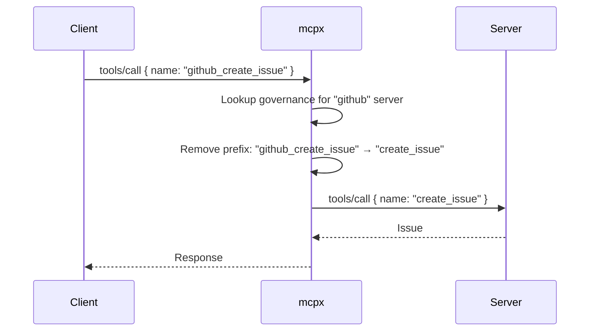
```mermaid
sequenceDiagram
    participant Client
    participant mcpx
    participant Server

    Client->>mcpx: tools/call { name: "github_create_issue" }
    mcpx->>mcpx: Lookup governance for "github" server
    mcpx->>mcpx: Remove prefix: "github_create_issue" → "create_issue"
    mcpx->>Server: tools/call { name: "create_issue" }
    Server-->>mcpx: Issue #123 created
    mcpx-->>Client: Response
```

#### Validation Rules

| Rule | Error Message |
|------|---------------|
| Both allowedTools and deniedTools set | `cannot specify both allowedTools and deniedTools (use one or the other)` |
| Invalid toolPrefix format | `invalid toolPrefix: must be alphanumeric with underscores (no spaces)` |

#### Response Format

```json
// GET /servers/github/tools
{
  "serverName": "github",
  "totalTools": 25,        // Total from MCP server
  "exposedTools": 10,      // After governance filtering
  "filteredTools": 15,     // Blocked by governance
  "tools": [
    { "name": "gh_create_issue", "description": "..." },
    { "name": "gh_list_repos", "description": "..." }
  ],
  "governance": {
    "serverName": "github",
    "allowedTools": ["create_issue", "list_repos"],
    "deniedTools": [],
    "toolPrefix": "gh"
  }
}
```

### 5. Virtual Gateway Aggregation

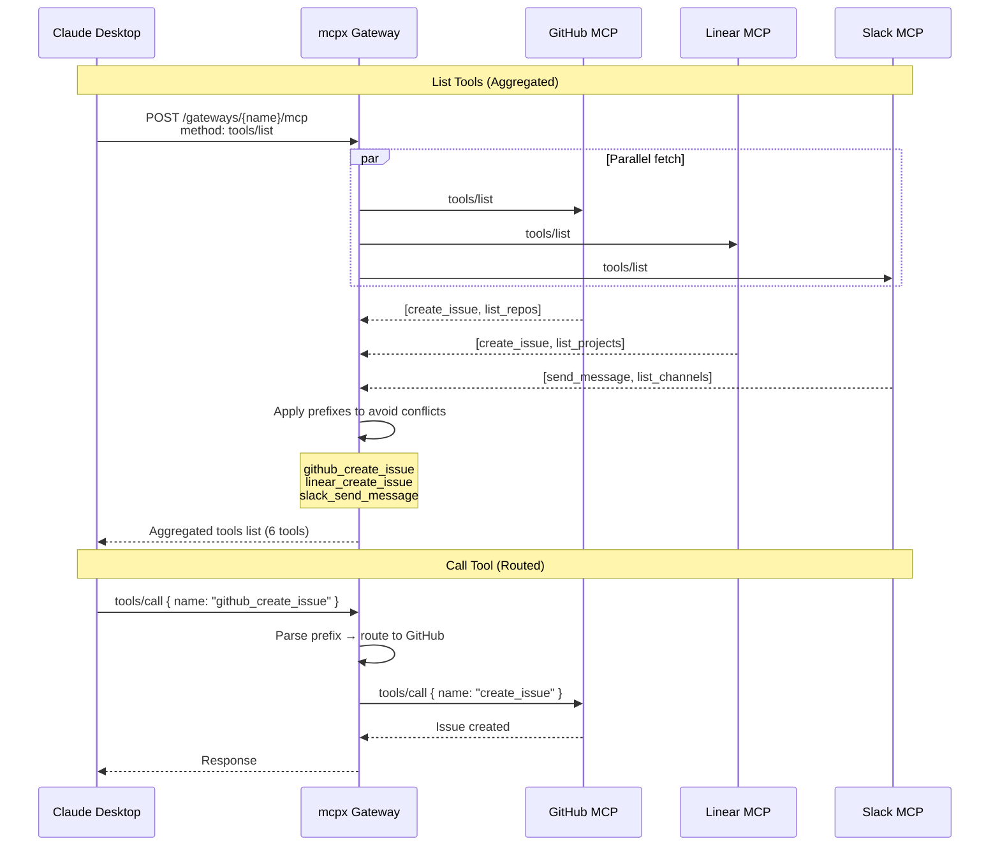
```mermaid
sequenceDiagram
    participant Client as Claude Desktop
    participant mcpx as mcpx Gateway
    participant S1 as GitHub MCP
    participant S2 as Linear MCP
    participant S3 as Slack MCP

    Note over Client,S3: List Tools (Aggregated)
    Client->>mcpx: POST /gateways/{name}/mcp<br/>method: tools/list
    
    par Parallel fetch
        mcpx->>S1: tools/list
        mcpx->>S2: tools/list
        mcpx->>S3: tools/list
    end
    
    S1-->>mcpx: [create_issue, list_repos]
    S2-->>mcpx: [create_issue, list_projects]
    S3-->>mcpx: [send_message, list_channels]
    
    mcpx->>mcpx: Apply prefixes to avoid conflicts
    Note over mcpx: github_create_issue<br/>linear_create_issue<br/>slack_send_message
    
    mcpx-->>Client: Aggregated tools list (6 tools)

    Note over Client,S3: Call Tool (Routed)
    Client->>mcpx: tools/call { name: "github_create_issue" }
    mcpx->>mcpx: Parse prefix → route to GitHub
    mcpx->>S1: tools/call { name: "create_issue" }
    S1-->>mcpx: Issue created
    mcpx-->>Client: Response
```

### 5.1 Virtual Gateway Session Aggregation

> **Critical Feature**: How mcpx manages a single client session across N backend MCP servers.

When a client connects to a Virtual Gateway (N servers exposed as 1), mcpx must:
1. Generate a **single gateway session ID** for the client
2. Maintain **separate session IDs** for each backend server
3. Route tool calls to the correct server with its **specific session ID**

#### Data Model

```typescript
// GatewaySession - stored in mcpx session cache
interface GatewaySession {
  gatewaySessionId: string;           // Single ID returned to client
  gatewayName: string;                // Gateway name (e.g., "my-gateway")
  serverSessions: Map<string, string>; // serverName → serverSessionId
  createdAt: Date;
  ttl: number;                        // Time to live in seconds (default: 3600)
}

// Example:
{
  "gatewaySessionId": "gw_abc123def456",
  "gatewayName": "productivity-tools",
  "serverSessions": {
    "github": "gh_session_789",     // GitHub's Mcp-Session-Id
    "linear": "lin_session_012",    // Linear's Mcp-Session-Id
    "slack": ""                     // Slack is stateless (no session)
  },
  "createdAt": "2025-01-15T10:00:00Z",
  "ttl": 3600
}
```

#### Sequence Diagram: Gateway Session Lifecycle

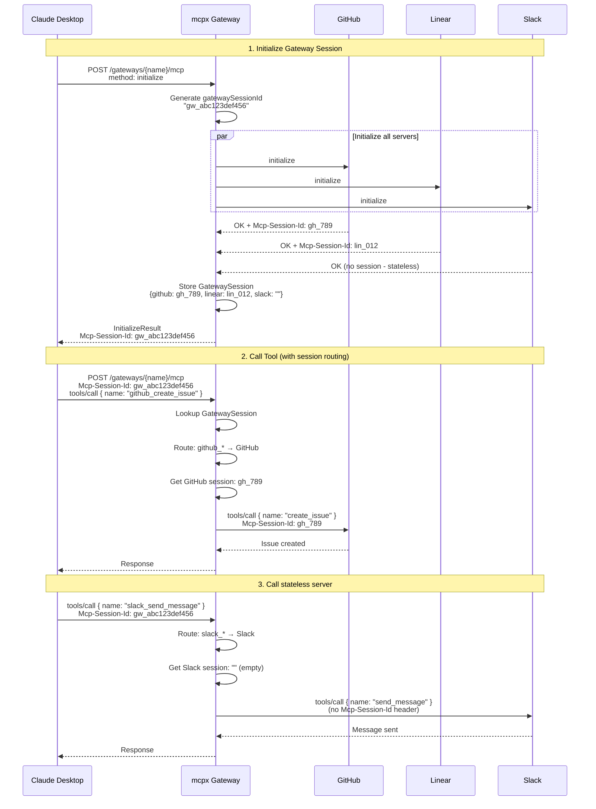
```mermaid
sequenceDiagram
    participant Client as Claude Desktop
    participant mcpx as mcpx Gateway
    participant GitHub
    participant Linear
    participant Slack

    Note over Client,Slack: 1. Initialize Gateway Session
    Client->>mcpx: POST /gateways/{name}/mcp<br/>method: initialize
    
    mcpx->>mcpx: Generate gatewaySessionId<br/>"gw_abc123def456"
    
    par Initialize all servers
        mcpx->>GitHub: initialize
        mcpx->>Linear: initialize
        mcpx->>Slack: initialize
    end
    
    GitHub-->>mcpx: OK + Mcp-Session-Id: gh_789
    Linear-->>mcpx: OK + Mcp-Session-Id: lin_012
    Slack-->>mcpx: OK (no session - stateless)
    
    mcpx->>mcpx: Store GatewaySession<br/>{github: gh_789, linear: lin_012, slack: ""}
    
    mcpx-->>Client: InitializeResult<br/>Mcp-Session-Id: gw_abc123def456

    Note over Client,Slack: 2. Call Tool (with session routing)
    Client->>mcpx: POST /gateways/{name}/mcp<br/>Mcp-Session-Id: gw_abc123def456<br/>tools/call { name: "github_create_issue" }
    
    mcpx->>mcpx: Lookup GatewaySession
    mcpx->>mcpx: Route: github_* → GitHub
    mcpx->>mcpx: Get GitHub session: gh_789
    
    mcpx->>GitHub: tools/call { name: "create_issue" }<br/>Mcp-Session-Id: gh_789
    GitHub-->>mcpx: Issue created
    mcpx-->>Client: Response

    Note over Client,Slack: 3. Call stateless server
    Client->>mcpx: tools/call { name: "slack_send_message" }<br/>Mcp-Session-Id: gw_abc123def456
    
    mcpx->>mcpx: Route: slack_* → Slack
    mcpx->>mcpx: Get Slack session: "" (empty)
    
    mcpx->>Slack: tools/call { name: "send_message" }<br/>(no Mcp-Session-Id header)
    Slack-->>mcpx: Message sent
    mcpx-->>Client: Response
```

#### Key Implementation Details

| Aspect | Implementation |
|--------|----------------|
| **Gateway Session ID** | Generated by mcpx, 32-char hex (16 bytes random) |
| **Session Storage** | In-memory cache or Redis (TTL 1 hour) |
| **Server Session ID** | Can be empty string for stateless servers |
| **Partial Failure** | Gateway continues if some servers fail to initialize |
| **Session Header** | Only forward `Mcp-Session-Id` if server session is non-empty |

#### Graceful Failure Handling

When initializing a gateway, some servers may fail. mcpx continues with available servers:

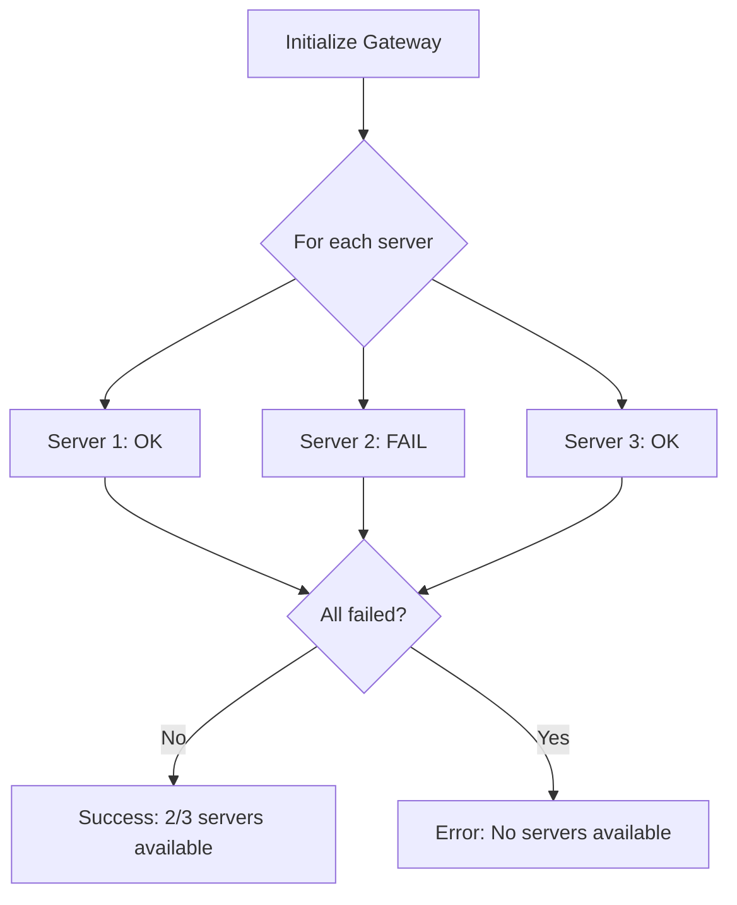
```mermaid
flowchart TB
    Init[Initialize Gateway] --> Fork{For each server}
    Fork --> S1[Server 1: OK]
    Fork --> S2[Server 2: FAIL]
    Fork --> S3[Server 3: OK]
    
    S1 --> Check{All failed?}
    S2 --> Check
    S3 --> Check
    
    Check -->|No| Success[Success: 2/3 servers available]
    Check -->|Yes| Error[Error: No servers available]
```

> **Reference**: [virtualgateway_handlers.go](file:///c:/Dev/git/mcpx/cmd/gateway/virtualgateway_handlers.go) (legacy implementation)

### 6. SSE Streaming Response

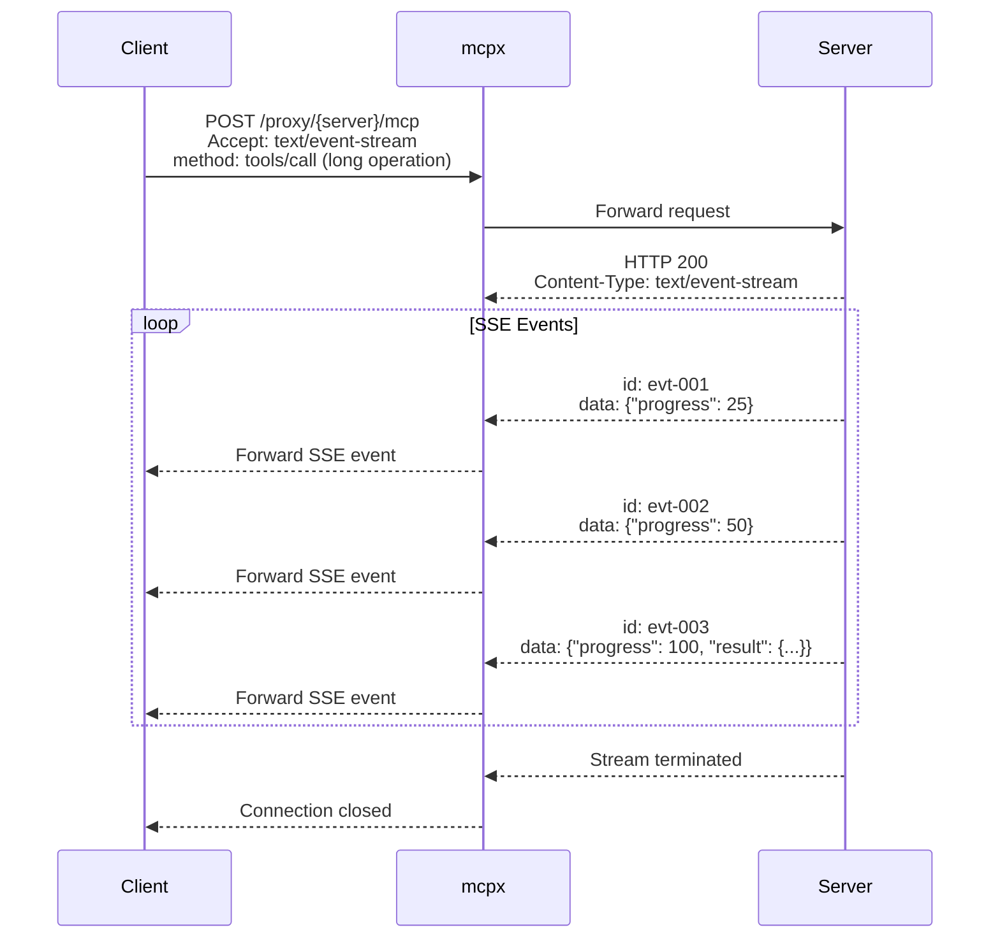
```mermaid
sequenceDiagram
    participant Client
    participant mcpx
    participant Server

    Client->>mcpx: POST /proxy/{server}/mcp<br/>Accept: text/event-stream<br/>method: tools/call (long operation)
    
    mcpx->>Server: Forward request
    
    Server-->>mcpx: HTTP 200<br/>Content-Type: text/event-stream
    
    loop SSE Events
        Server-->>mcpx: id: evt-001<br/>data: {"progress": 25}
        mcpx-->>Client: Forward SSE event
        
        Server-->>mcpx: id: evt-002<br/>data: {"progress": 50}
        mcpx-->>Client: Forward SSE event
        
        Server-->>mcpx: id: evt-003<br/>data: {"progress": 100, "result": {...}}
        mcpx-->>Client: Forward SSE event
    end
    
    Server-->>mcpx: Stream terminated
    mcpx-->>Client: Connection closed
```

### 7. Credential Injection

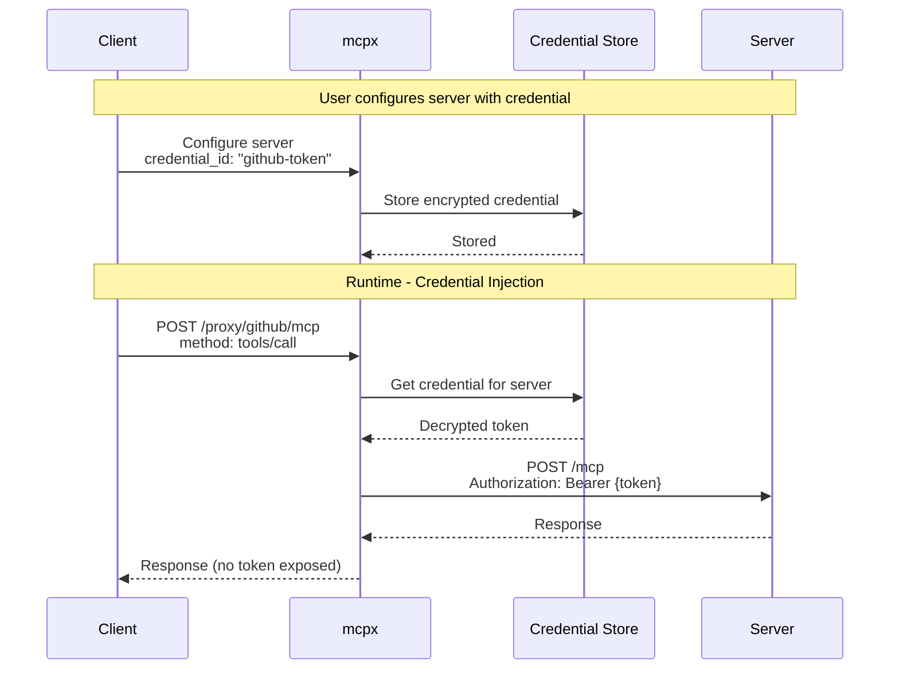
```mermaid
sequenceDiagram
    participant Client
    participant mcpx
    participant Vault as Credential Store
    participant Server

    Note over Client,Server: User configures server with credential
    Client->>mcpx: Configure server<br/>credential_id: "github-token"
    mcpx->>Vault: Store encrypted credential
    Vault-->>mcpx: Stored

    Note over Client,Server: Runtime - Credential Injection
    Client->>mcpx: POST /proxy/github/mcp<br/>method: tools/call
    mcpx->>Vault: Get credential for server
    Vault-->>mcpx: Decrypted token
    mcpx->>Server: POST /mcp<br/>Authorization: Bearer {token}
    Server-->>mcpx: Response
    mcpx-->>Client: Response (no token exposed)
```

---

# MCP TRANSPORT LAYER

> **Reference**: [MCP Specification 2025-11-25 - Transports](https://modelcontextprotocol.io/specification/2025-11-25/basic/transports)

mcpx implements the **Streamable HTTP** transport as the primary and recommended transport layer. This is the modern MCP transport that supersedes the deprecated HTTP+SSE transport.

## Transport Strategy

| Transport | Support | Notes |
|-----------|---------|-------|
| **Streamable HTTP** | ✅ Primary | Modern, recommended transport |
| HTTP+SSE (legacy) | ⚠️ Backwards Compat | Only for legacy server support |
| stdio | ❌ Not Supported | Local process only, not applicable for SaaS |

## Streamable HTTP Overview

Streamable HTTP uses a **single HTTP endpoint** for all communication:

```
https://mcpx.app/proxy/{user-id}/{server-name}/mcp
```

- **POST**: Client sends JSON-RPC messages to server
- **GET**: Client opens SSE stream for server-initiated messages
- **DELETE**: Client terminates session

## Session Management (`Mcp-Session-Id`)

MCP supports both **stateless** and **stateful** operation modes.

### Stateless Mode (No Session)

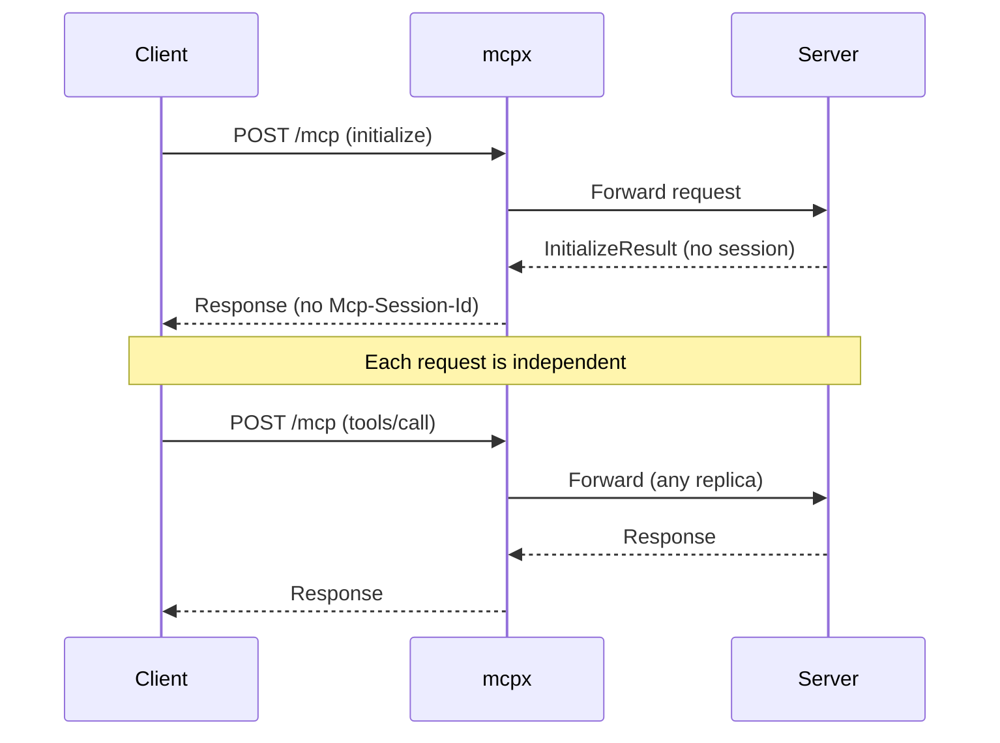
```mermaid
sequenceDiagram
    participant Client
    participant mcpx
    participant Server
    
    Client->>mcpx: POST /mcp (initialize)
    mcpx->>Server: Forward request
    Server-->>mcpx: InitializeResult (no session)
    mcpx-->>Client: Response (no Mcp-Session-Id)
    
    Note over Client,Server: Each request is independent
    Client->>mcpx: POST /mcp (tools/call)
    mcpx->>Server: Forward (any replica)
    Server-->>mcpx: Response
    mcpx-->>Client: Response
```

- Server does NOT return `Mcp-Session-Id` header
- Client does NOT include session header in requests
- Each request is independent - can be routed to any server replica
- **Use case**: Simple, stateless tools (weather, calculations)

### Stateful Mode (With Session)

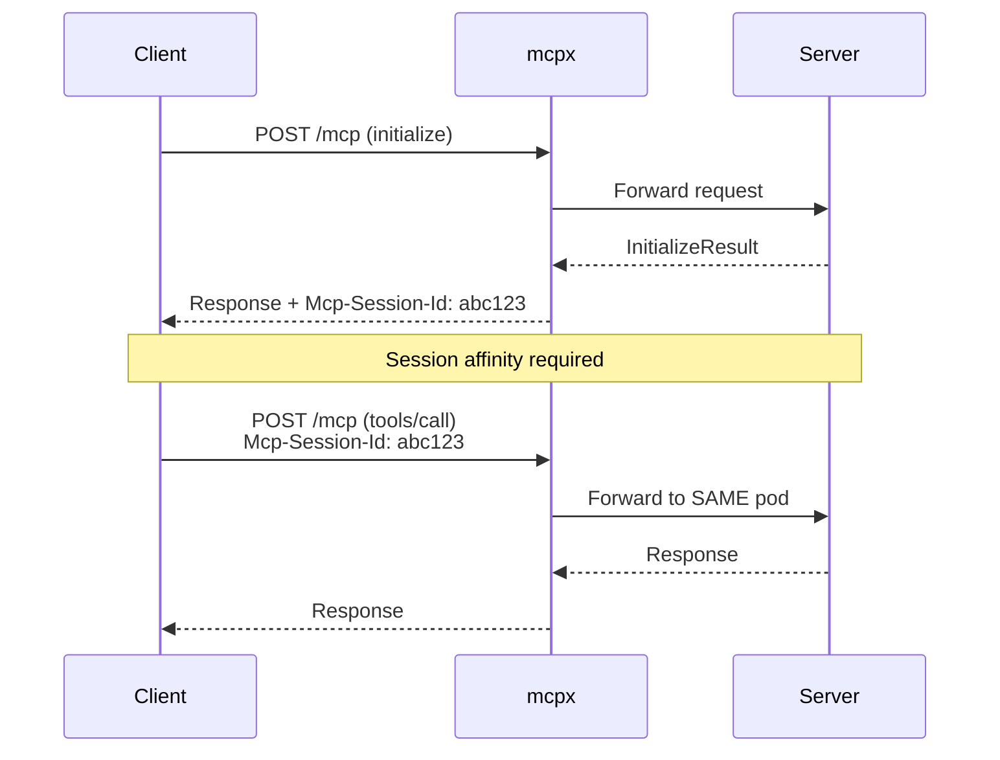
```mermaid
sequenceDiagram
    participant Client
    participant mcpx
    participant Server
    
    Client->>mcpx: POST /mcp (initialize)
    mcpx->>Server: Forward request
    Server-->>mcpx: InitializeResult
    mcpx-->>Client: Response + Mcp-Session-Id: abc123
    
    Note over Client,Server: Session affinity required
    Client->>mcpx: POST /mcp (tools/call)<br/>Mcp-Session-Id: abc123
    mcpx->>Server: Forward to SAME pod
    Server-->>mcpx: Response
    mcpx-->>Client: Response
```

- Server RETURNS `Mcp-Session-Id` header in `InitializeResult`
- Client MUST include `Mcp-Session-Id` in ALL subsequent requests
- mcpx MUST route to the SAME server pod (session affinity)
- **Use case**: Stateful operations (database connections, file handles)

### Session ID Requirements

| Requirement | Description |
|-------------|-------------|
| **Uniqueness** | Globally unique, cryptographically secure (UUID, JWT, or hash) |
| **Characters** | Visible ASCII only (0x21 to 0x7E) |
| **Security** | Must be handled securely to prevent hijacking |

### Session Lifecycle

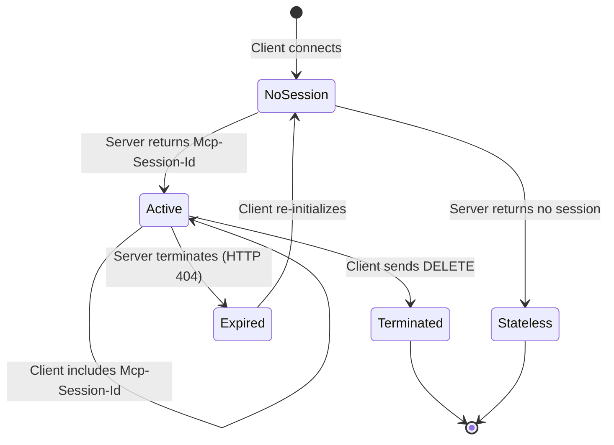
```mermaid
stateDiagram-v2
    [*] --> NoSession: Client connects
    NoSession --> Active: Server returns Mcp-Session-Id
    NoSession --> Stateless: Server returns no session
    
    Active --> Active: Client includes Mcp-Session-Id
    Active --> Expired: Server terminates (HTTP 404)
    Active --> Terminated: Client sends DELETE
    
    Expired --> NoSession: Client re-initializes
    Terminated --> [*]
    Stateless --> [*]
```

### Session Error Handling

| HTTP Status | Meaning | Client Action |
|-------------|---------|---------------|
| `400 Bad Request` | Missing required `Mcp-Session-Id` | Include session header |
| `404 Not Found` | Session expired/terminated | Send new `InitializeRequest` |
| `405 Method Not Allowed` | DELETE not supported | Session cleanup handled by server |

## Sending Messages (POST)

Client sends JSON-RPC messages via HTTP POST:

```http
POST /mcp HTTP/1.1
Host: mcpx.app
Content-Type: application/json
Accept: application/json, text/event-stream
Mcp-Session-Id: abc123
Mcp-Protocol-Version: 2025-11-25

{
  "jsonrpc": "2.0",
  "id": 1,
  "method": "tools/call",
  "params": { "name": "get_weather", "arguments": { "city": "Tokyo" } }
}
```

### Response Types

| Content-Type | Description |
|--------------|-------------|
| `application/json` | Single JSON-RPC response |
| `text/event-stream` | SSE stream with response + notifications |

### Response for Notifications/Responses

When client sends a JSON-RPC notification or response:
- **Success**: `202 Accepted` (no body)
- **Failure**: HTTP error (e.g., `400 Bad Request`)

## Streaming Responses (SSE)

For long-running operations, server returns SSE stream:

```http
HTTP/1.1 200 OK
Content-Type: text/event-stream
Mcp-Session-Id: abc123

id: evt-001
data: 

id: evt-002
data: {"jsonrpc":"2.0","method":"notifications/progress","params":{"progress":50}}

id: evt-003
data: {"jsonrpc":"2.0","id":1,"result":{"content":[{"type":"text","text":"Sunny, 25°C"}]}}
```

### SSE Event Rules

1. Server SHOULD send initial event with ID + empty data (primes reconnection)
2. Server MAY close connection without terminating stream (client reconnects)
3. Server SHOULD send `retry` field before closing (reconnect delay in ms)
4. After JSON-RPC response is sent, server SHOULD terminate stream
5. Disconnection ≠ cancellation (client must send `CancelledNotification`)

## Listening for Server Messages (GET)

Client can open SSE stream for server-initiated messages:

```http
GET /mcp HTTP/1.1
Host: mcpx.app
Accept: text/event-stream
Mcp-Session-Id: abc123
```

- Server returns `text/event-stream` or `405 Method Not Allowed`
- Server MAY send requests/notifications unrelated to client requests
- Server MUST NOT send JSON-RPC responses (only requests/notifications)

## Resumability and Redelivery

mcpx SHOULD support stream resumption for reliability:

```http
GET /mcp HTTP/1.1
Host: mcpx.app
Accept: text/event-stream
Mcp-Session-Id: abc123
Last-Event-ID: evt-002
```

- Event IDs MUST be globally unique within session
- Client includes `Last-Event-ID` header to resume
- Server MAY replay messages after the last event ID
- Server MUST NOT replay messages from different streams

## Protocol Version Header

All requests MUST include protocol version:

```http
Mcp-Protocol-Version: 2025-11-25
```

- Version is negotiated during initialization
- Mismatched versions: `400 Bad Request`

## Security Requirements

| Requirement | Implementation |
|-------------|----------------|
| **Origin Validation** | Validate `Origin` header, return `403 Forbidden` if invalid |
| **Localhost Binding** | Local servers bind to `127.0.0.1` only |
| **Authentication** | All connections require proper auth |
| **Session Security** | Secure handling of `Mcp-Session-Id` |

## mcpx Gateway Responsibilities

As a proxy, mcpx must:

1. **Forward all MCP headers**: `Mcp-Session-Id`, `Mcp-Protocol-Version`
2. **Maintain session affinity**: Route stateful requests to same pod
3. **Handle SSE proxying**: Stream events without buffering
4. **Support resumption**: Track event IDs for reconnection
5. **Add authentication**: Inject user/tenant context
6. **Apply governance**: Filter tools before forwarding

## Backwards Compatibility (HTTP+SSE)

For legacy servers using deprecated HTTP+SSE transport:

1. Attempt POST `InitializeRequest` to server
2. If fails with `400`/`404`/`405`, fall back to HTTP+SSE:
   - GET to open SSE stream
   - Wait for `endpoint` event
   - Use legacy transport

mcpx SHOULD auto-detect transport and use appropriate proxy mode.

---

# POPULAR MCP SERVERS FOR TESTING

> Use these publicly available **remote MCP servers** to test mcpx functionality.
> All servers use **Streamable HTTP** transport — no stdio.

---

## 🟢 Open Servers (No Auth Required)

These servers are **publicly accessible without authentication** — ideal for initial testing and development.

### MCP Reference Server (Official - Anthropic)

The **official Anthropic reference server** demonstrates all MCP features. **No authentication required** for basic testing.

| Property | Value |
|----------|-------|
| **URL** | `https://example-server.modelcontextprotocol.io/mcp` |
| **Transport** | Streamable HTTP |
| **Auth** | **None** (public demo) |
| **Session** | Stateful (`Mcp-Session-Id`) |
| **Features** | Tools, Resources, Prompts, Sampling, Elicitation |

### Configuration

```json
{
  "mcpServers": {
    "mcp-reference": {
      "type": "http",
      "url": "https://example-server.modelcontextprotocol.io/mcp"
    }
  }
}
```

### Available Tools

| Tool | Description |
|------|-------------|
| `echo` | Echo input back |
| `add` | Add two numbers |
| `longRunningOperation` | Test long-running operations |
| `sampleLLM` | Test LLM sampling |

### Quick Test

```bash
# Test connectivity (no auth!)
curl -X POST https://example-server.modelcontextprotocol.io/mcp \
  -H "Content-Type: application/json" \
  -H "Accept: application/json, text/event-stream" \
  -d '{"jsonrpc":"2.0","id":1,"method":"initialize","params":{"protocolVersion":"2025-11-25","capabilities":{},"clientInfo":{"name":"mcpx-test","version":"1.0"}}}'
```

> **Source**: [modelcontextprotocol/example-remote-server](https://github.com/modelcontextprotocol/example-remote-server)

---

## 🔐 Authenticated Servers

These servers require authentication but are production-ready for full integration testing.

## GitHub MCP Server (Official)

GitHub's official MCP server is the **gold standard** for testing remote Streamable HTTP transport.

| Property | Value |
|----------|-------|
| **URL** | `https://api.githubcopilot.com/mcp/` |
| **Transport** | Streamable HTTP |
| **Auth** | OAuth 2.1 or Personal Access Token (PAT) |
| **Session** | Stateful (`Mcp-Session-Id`) |

### Configuration

```json
{
  "mcpServers": {
    "github": {
      "type": "http",
      "url": "https://api.githubcopilot.com/mcp/",
      "headers": {
        "Authorization": "Bearer <GITHUB_PAT>"
      }
    }
  }
}
```

### Available Tools (Subset)

| Tool | Description |
|------|-------------|
| `list_repositories` | List user's repositories |
| `get_repository` | Get repository details |
| `create_issue` | Create GitHub issue |
| `list_issues` | List issues in repository |
| `create_pull_request` | Create pull request |
| `get_file_contents` | Get file from repository |
| `search_code` | Search code across repos |
| `list_workflow_runs` | List GitHub Actions runs |

> **Source**: [github/github-mcp-server](https://github.com/github/github-mcp-server)

---

## Linear MCP Server

Linear provides a remote MCP server for project management integration.

| Property | Value |
|----------|-------|
| **URL (Streamable HTTP)** | `https://mcp.linear.app/mcp` |
| **URL (SSE - legacy)** | `https://mcp.linear.app/sse` |
| **Transport** | Streamable HTTP (recommended) |
| **Auth** | OAuth 2.1 with dynamic client registration |
| **Session** | Stateful |

### Configuration

```json
{
  "mcpServers": {
    "linear": {
      "type": "http",
      "url": "https://mcp.linear.app/mcp"
    }
  }
}
```

### Available Tools

| Tool | Description |
|------|-------------|
| `list_issues` | List Linear issues |
| `create_issue` | Create new issue |
| `update_issue` | Update issue status |
| `list_projects` | List projects |
| `search_issues` | Search issues |

> **Source**: [Linear MCP Documentation](https://linear.app/docs/mcp)

---

## DevRev MCP Server

DevRev provides a remote MCP server for customer support integration.

| Property | Value |
|----------|-------|
| **URL** | `https://api.devrev.ai/mcp/v1` |
| **Transport** | Streamable HTTP |
| **Auth** | API Key or OAuth |
| **Session** | Stateful |

### Configuration

```json
{
  "mcpServers": {
    "devrev": {
      "type": "http",
      "url": "https://api.devrev.ai/mcp/v1",
      "headers": {
        "Authorization": "Bearer <DEVREV_API_KEY>"
      }
    }
  }
}
```

> **Source**: [DevRev MCP Documentation](https://docs.devrev.ai/mcp)

---

## Smithery Registry

Smithery.ai is a **registry of remote MCP servers** that can be connected via HTTP.

| Property | Value |
|----------|-------|
| **Registry URL** | `https://smithery.ai/servers` |
| **Transport** | Streamable HTTP |
| **Available Servers** | Gmail, Slack, Google Sheets, GitHub, LinkedIn, etc. |

### How to Use

1. Browse available servers at [smithery.ai/servers](https://smithery.ai/servers)
2. Get the server URL and auth requirements
3. Configure in mcpx with appropriate credentials

> **Source**: [Smithery.ai](https://smithery.ai)

---

## Cloudflare Workers MCP

Deploy your own MCP server on Cloudflare edge with Streamable HTTP.

| Property | Value |
|----------|-------|
| **Transport** | Streamable HTTP |
| **Hosting** | Serverless, global edge |
| **Auth** | Custom (OAuth, API key) |

### Example Deployment

```bash
# Create new Cloudflare MCP server
npx create-cloudflare mcp-server --template mcp

# Deploy
wrangler deploy
```

> **Source**: [Cloudflare MCP Guide](https://developers.cloudflare.com/workers/tutorials/build-a-mcp-server/)

---

## Test Configuration Matrix

| Server | URL | Auth | Session | Best For |
|--------|-----|------|---------|----------|
| **GitHub** | `api.githubcopilot.com/mcp/` | OAuth/PAT | Stateful | Full integration, tool governance |
| **Linear** | `mcp.linear.app/mcp` | OAuth 2.1 | Stateful | OAuth flow testing |
| **DevRev** | `api.devrev.ai/mcp/v1` | API Key | Stateful | API key auth testing |
| **Smithery** | Various | Varies | Varies | Multiple integrations |
| **Cloudflare** | Self-hosted | Custom | Configurable | Custom server testing |

## Recommended Test Scenarios

### 1. Basic Connectivity
```bash
# Test with GitHub (requires PAT)
curl -X POST https://api.githubcopilot.com/mcp/ \
  -H "Authorization: Bearer $GITHUB_PAT" \
  -H "Content-Type: application/json" \
  -H "Accept: application/json, text/event-stream" \
  -d '{"jsonrpc":"2.0","id":1,"method":"initialize","params":{"protocolVersion":"2025-11-25","capabilities":{},"clientInfo":{"name":"mcpx","version":"1.0"}}}'
```

### 2. Session Management
- Connect to GitHub or Linear
- Verify `Mcp-Session-Id` header in response
- Include session header in subsequent requests
- Test session expiration handling

### 3. Tool Governance
- List available tools from server
- Test tool filtering (allow/deny)
- Verify tool prefixing works correctly

### 4. OAuth Flow
- Test OAuth 2.1 with Linear (dynamic client registration)
- Verify token refresh flow
- Test token expiration handling

---

# VISUAL IDENTITY

**Follow TM Dev Lab design system 100%**

## Colors

```css
--primary: #6366f1;      /* Indigo */
--accent: #ec4899;       /* Pink */
--bg-darker: #020617;    /* Page */
--bg-card: #1e293b;      /* Cards */
--text-primary: #f8fafc; /* White */
```

## Gradients

```css
/* Logo, CTAs */
background: linear-gradient(135deg, #6366f1, #ec4899);

/* Text gradient */
background: linear-gradient(135deg, #6366f1, #ec4899);
-webkit-background-clip: text;
-webkit-text-fill-color: transparent;
```

## Logo

```html
<div class="brand">
  <span class="logo">MX</span>
  <span class="brand-text">mcpx</span>
</div>
```

```css
.logo {
  background: linear-gradient(135deg, #6366f1, #8b5cf6);
  color: white;
  width: 40px;
  height: 40px;
  display: flex;
  align-items: center;
  justify-content: center;
  border-radius: 8px;
  font-weight: 800;
}

.brand-text {
  background: linear-gradient(135deg, #6366f1, #ec4899);
  -webkit-background-clip: text;
  -webkit-text-fill-color: transparent;
  font-weight: 700;
}
```

## Components

**Buttons:**
```css
.btn-primary {
  background: linear-gradient(135deg, #6366f1, #ec4899);
  color: white;
  padding: 0.75rem 2rem;
  border-radius: 6px;
  font-weight: 600;
}

.btn-secondary {
  background: transparent;
  color: #6366f1;
  border: 2px solid #6366f1;
}
```

**Cards:**
```css
.card {
  background: #1e293b;
  border: 1px solid #334155;
  border-radius: 8px;
  padding: 1.5rem;
}

.card:hover {
  border-color: #6366f1;
  transform: translateY(-2px);
}
```

---

# MARKET OPPORTUNITY

## The MCP Ecosystem (2024-2025)

**Model Context Protocol (MCP)** is Anthropic's open standard for connecting AI assistants (Claude, GPT-4) to external data sources and tools. Since its launch in November 2024, adoption has grown rapidly:

- **500+ MCP servers** published on GitHub
- **Claude Desktop** native MCP integration (100K+ users)
- **Growing enterprise interest** in AI tool ecosystems

### Current Pain Points

**For Developers:**
1. **Infrastructure Complexity:** Deploying MCP servers requires K8s/Docker knowledge
2. **No Governance:** Can't control which tools are exposed to AI
3. **No Visibility:** No logs, no audit trail of AI tool usage
4. **Authentication Gaps:** No built-in OAuth, API key management is manual
5. **Vendor Lock-in:** Tight coupling to specific cloud providers

**For Organizations:**
1. **Security Concerns:** No fine-grained access control
2. **Compliance:** No audit logs for tool usage
3. **Proliferation:** Each team deploys servers differently
4. **Cost:** Over-provisioned infrastructure for simple proxying

## Market Size

### Addressable Market (TAM)
- **AI Developers:** 5M+ globally (GitHub Copilot users as proxy)
- **Enterprises:** 50K+ companies experimenting with AI agents
- **MCP Ecosystem:** Growing 30% MoM (GitHub activity)

### Serviceable Market (SAM)
- **Professional Developers:** 1M+ building AI applications
- **Startups:** 10K+ AI-first companies
- **Mid-market:** 5K+ companies with AI initiatives

### Obtainable Market (SOM - Year 1)
- **Developer Sign-ups:** 500-1,000
- **Paying Customers:** 50-100 (10% conversion)
- **Enterprise Pilots:** 3-5

## Competitive Landscape

### Direct Competitors
**None.** No SaaS platform currently offers MCP management with governance.

### Indirect Competitors
1. **Self-hosted solutions:** Teams build custom K8s deployments
   - **Our advantage:** Zero infrastructure, 10-second setup
2. **API Gateway vendors:** Kong, Apigee (not MCP-aware)
   - **Our advantage:** MCP-native features (tool governance, virtual gateways)
3. **Reverse tunnels:** ngrok, Cloudflare Tunnel
   - **Our advantage:** Governance, multi-server aggregation, audit logs

### Strategic Positioning

**"The Vercel of MCP"** - Developer experience first, infrastructure abstracted away.

---

# PRODUCT VISION

## Mission

**Democratize access to MCP servers by removing infrastructure complexity and adding enterprise-grade governance.**

## Value Proposition

**"From URL to Production in 10 Seconds"** - Web-based MCP management with built-in governance

## User Flow

```
Developer → Sign in (Google) → Add Server (URL) → Get Public URL → Use in Claude
```

## Example

```
1. User: alice@gmail.com
2. Logs in: https://mcpx.tmdevlab.com
3. Adds server:
   Name: weather-api
   URL: https://weather.com/mcp
   Auth: API Key (sk_abc123...)
4. Gets URL: https://mcpx.tmdevlab.com/api/proxy/alice-123/weather/mcp
5. Configures Claude Desktop:
   {
     "mcpServers": {
       "weather": {
         "url": "https://mcpx.tmdevlab.com/api/proxy/alice-123/weather/mcp"
       }
     }
   }
6. Claude uses weather tools via mcpx proxy
```

---

# TECHNICAL ARCHITECTURE

## High-Level

```
Browser (Vue 3 SPA)
    ↓ HTTPS
K8s Service → Frontend pod (Vue + Nginx)
    ↓ REST API
K8s Service → Backend pod (Rust + Axum)
    ↓
PostgreSQL pod (users, servers, logs)
Redis pod (cache, rate limiting)
    ↓ MCP Proxy
Upstream MCP Server (user's external server)


Claude Desktop
    ↓ MCP over HTTP
K8s Service → Backend pod (Rust)
    ↓ Direct proxy
Upstream MCP Server
```

## Stack

| Layer | Technology |
|-------|------------|
| Frontend | Vue 3 + Vite + Tailwind CSS |
| Backend | Rust + Axum (web framework) |
| Auth | OAuth2 (oauth2-rs + Google provider) |
| Database | PostgreSQL 15 + SQLx (K8s pod + PVC) |
| Cache | Redis 7 + redis-rs (K8s pod + PVC) |
| Orchestration | Kubernetes (Docker Desktop local) |
| Cloud Deploy | Any K8s (AKS, EKS, GKE, DOKS) |

**Architecture:** Decoupled frontend + backend (2 separate containers)

## Data Flow (Example)

```
1. Claude → POST /api/proxy/alice-123/weather/mcp
   Body: {method: "tools/call", params: {name: "get_weather"}}

2. Proxy validates:
   - User exists (alice-123)
   - Server exists (weather)
   - Rate limit ok
   - Tool allowed (governance)

3. Proxy calls upstream:
   POST https://weather.com/mcp
   Headers: Authorization: Bearer sk_abc123...
   Body: {method: "tools/call", ...}

4. Upstream responds:
   {result: {temp: 72, ...}}

5. Proxy logs request:
   user_id: alice-123
   server_id: weather
   tool: get_weather
   status: 200
   latency: 45ms

6. Proxy returns to Claude:
   {result: {temp: 72, ...}}
```

---

# DATA MODELS

## SQL Migrations (SQLx)

**File:** `backend/migrations/001_init.sql`

```sql
-- Users table
CREATE TABLE users (
    id UUID PRIMARY KEY DEFAULT gen_random_uuid(),
    email VARCHAR(255) NOT NULL UNIQUE,
    name VARCHAR(255),
    image TEXT,
    created_at TIMESTAMPTZ NOT NULL DEFAULT NOW(),
    updated_at TIMESTAMPTZ NOT NULL DEFAULT NOW()
);

CREATE INDEX idx_users_email ON users(email);

-- Servers table
CREATE TABLE servers (
    id UUID PRIMARY KEY DEFAULT gen_random_uuid(),
    user_id UUID NOT NULL REFERENCES users(id) ON DELETE CASCADE,
    name VARCHAR(255) NOT NULL,
    slug VARCHAR(255) NOT NULL,
    description TEXT,

    upstream_url TEXT NOT NULL,
    upstream_auth_type VARCHAR(50) NOT NULL DEFAULT 'none',
    upstream_auth_config JSONB,  -- encrypted credentials

    governance_enabled BOOLEAN NOT NULL DEFAULT false,
    governance_config JSONB,  -- {allowed_tools: [...], denied_tools: [...]}

    status VARCHAR(50) NOT NULL DEFAULT 'active',
    total_requests INTEGER NOT NULL DEFAULT 0,
    last_request_at TIMESTAMPTZ,

    created_at TIMESTAMPTZ NOT NULL DEFAULT NOW(),
    updated_at TIMESTAMPTZ NOT NULL DEFAULT NOW(),

    UNIQUE(user_id, slug)
);

CREATE INDEX idx_servers_user_id ON servers(user_id);
CREATE INDEX idx_servers_status ON servers(status);

-- Request logs table
CREATE TABLE request_logs (
    id UUID PRIMARY KEY DEFAULT gen_random_uuid(),
    user_id UUID NOT NULL REFERENCES users(id) ON DELETE CASCADE,
    server_id UUID NOT NULL REFERENCES servers(id) ON DELETE CASCADE,

    method VARCHAR(100) NOT NULL,  -- "tools/call", "tools/list"
    tool_name VARCHAR(255),         -- "get_weather"

    status_code INTEGER NOT NULL,  -- 200, 403, 502
    latency_ms INTEGER NOT NULL,   -- 45
    error TEXT,

    created_at TIMESTAMPTZ NOT NULL DEFAULT NOW()
);

CREATE INDEX idx_request_logs_server_id ON request_logs(server_id, created_at DESC);
CREATE INDEX idx_request_logs_user_id ON request_logs(user_id, created_at DESC);

-- Updated_at trigger
CREATE OR REPLACE FUNCTION update_updated_at_column()
RETURNS TRIGGER AS $$
BEGIN
    NEW.updated_at = NOW();
    RETURN NEW;
END;
$$ language 'plpgsql';

CREATE TRIGGER update_users_updated_at BEFORE UPDATE ON users
    FOR EACH ROW EXECUTE FUNCTION update_updated_at_column();

CREATE TRIGGER update_servers_updated_at BEFORE UPDATE ON servers
    FOR EACH ROW EXECUTE FUNCTION update_updated_at_column();
```

**Rust Structs (SQLx):**

```rust
// src/models.rs
use sqlx::FromRow;
use serde::{Deserialize, Serialize};
use uuid::Uuid;
use chrono::{DateTime, Utc};

#[derive(Debug, Clone, FromRow, Serialize, Deserialize)]
pub struct User {
    pub id: Uuid,
    pub email: String,
    pub name: Option<String>,
    pub image: Option<String>,
    pub created_at: DateTime<Utc>,
    pub updated_at: DateTime<Utc>,
}

#[derive(Debug, Clone, FromRow, Serialize, Deserialize)]
pub struct Server {
    pub id: Uuid,
    pub user_id: Uuid,
    pub name: String,
    pub slug: String,
    pub description: Option<String>,
    pub upstream_url: String,
    pub upstream_auth_type: String,
    pub upstream_auth_config: Option<serde_json::Value>,
    pub governance_enabled: bool,
    pub governance_config: Option<serde_json::Value>,
    pub status: String,
    pub total_requests: i32,
    pub last_request_at: Option<DateTime<Utc>>,
    pub created_at: DateTime<Utc>,
    pub updated_at: DateTime<Utc>,
}

#[derive(Debug, Clone, FromRow, Serialize, Deserialize)]
pub struct RequestLog {
    pub id: Uuid,
    pub user_id: Uuid,
    pub server_id: Uuid,
    pub method: String,
    pub tool_name: Option<String>,
    pub status_code: i32,
    pub latency_ms: i32,
    pub error: Option<String>,
    pub created_at: DateTime<Utc>,
}
```

## Redis Cache

```
# Governance config (TTL: 5min)
governance:{server_id} → {allowed_tools: [...]}

# Rate limiting (TTL: 1min)
rate_limit:{user_id}:{server_id}:minute → Sorted Set

# Server status (TTL: 1min)
server:{server_id}:status → "active"
```

---

# AUTHENTICATION & SECURITY

## OAuth 2.0 (Google)

**Flow:**
```
1. User clicks "Sign in with Google" (Vue frontend)
2. Frontend redirects to /api/auth/google (Rust backend)
3. Backend redirects to Google OAuth consent
4. User approves
5. Google redirects back with code
6. Backend exchanges code for Google token
7. Backend creates/lookups user in PostgreSQL
8. Backend generates JWT token (30 days)
9. Backend returns JWT to frontend
10. Frontend stores JWT in localStorage
11. Redirect to /dashboard
```

**Implementation (Rust + Axum):**

```rust
// src/auth.rs
use axum::{extract::Query, response::Redirect, Extension, Json};
use oauth2::{
    AuthorizationCode, CsrfToken, PkceCodeChallenge, Scope,
    TokenResponse, basic::BasicClient,
};
use sqlx::PgPool;
use jsonwebtoken::{encode, Header, EncodingKey};

// Cargo.toml dependencies:
// oauth2 = "4.4"
// jsonwebtoken = "9.2"
// serde = { version = "1.0", features = ["derive"] }

#[derive(Serialize)]
struct Claims {
    sub: String,  // user_id
    email: String,
    exp: usize,   // expiration
}

// Step 1: Initiate Google OAuth
async fn google_login(
    Extension(oauth_client): Extension<BasicClient>,
) -> Redirect {
    let (auth_url, _csrf_token) = oauth_client
        .authorize_url(CsrfToken::new_random)
        .add_scope(Scope::new("email".to_string()))
        .add_scope(Scope::new("profile".to_string()))
        .url();

    Redirect::to(auth_url.as_str())
}

// Step 2: Handle OAuth callback
#[derive(Deserialize)]
struct CallbackQuery {
    code: String,
}

async fn google_callback(
    Query(query): Query<CallbackQuery>,
    Extension(oauth_client): Extension<BasicClient>,
    Extension(db): Extension<PgPool>,
) -> Json<AuthResponse> {
    // Exchange code for token
    let token = oauth_client
        .exchange_code(AuthorizationCode::new(query.code))
        .request_async(oauth2::reqwest::async_http_client)
        .await
        .unwrap();

    // Get user info from Google
    let user_info = get_google_user_info(token.access_token()).await;

    // Create or update user in DB
    let user = sqlx::query_as::<_, User>(
        "INSERT INTO users (email, name, image)
         VALUES ($1, $2, $3)
         ON CONFLICT (email) DO UPDATE SET updated_at = NOW()
         RETURNING id, email, name, image"
    )
    .bind(&user_info.email)
    .bind(&user_info.name)
    .bind(&user_info.picture)
    .fetch_one(&db)
    .await
    .unwrap();

    // Generate JWT
    let jwt_secret = std::env::var("JWT_SECRET").unwrap();
    let claims = Claims {
        sub: user.id.to_string(),
        email: user.email,
        exp: (chrono::Utc::now() + chrono::Duration::days(30)).timestamp() as usize,
    };

    let token = encode(
        &Header::default(),
        &claims,
        &EncodingKey::from_secret(jwt_secret.as_bytes()),
    ).unwrap();

    Json(AuthResponse { token, user })
}
```

## Authorization

**Web Dashboard (Vue):**
- JWT stored in `localStorage`
- Axios interceptor adds `Authorization: Bearer {jwt}` header
- Backend validates JWT on every API request

**MCP Proxy:**
- Public endpoint, user identified by URL:
  ```
  /api/proxy/{userId}/{serverId}/mcp
  ```
- `userId` = UUID (non-guessable)
- `serverId` = UUID (non-guessable)
- Rate limited (Redis)
- Invalid returns 404 (not 403, prevents enumeration)

**Rust Middleware:**

```rust
// src/middleware/auth.rs
use axum::http::{Request, StatusCode};
use jsonwebtoken::{decode, DecodingKey, Validation};

async fn auth_middleware<B>(
    req: Request<B>,
    next: Next<B>,
) -> Result<Response, StatusCode> {
    let auth_header = req
        .headers()
        .get("authorization")
        .and_then(|v| v.to_str().ok())
        .ok_or(StatusCode::UNAUTHORIZED)?;

    let token = auth_header
        .strip_prefix("Bearer ")
        .ok_or(StatusCode::UNAUTHORIZED)?;

    let jwt_secret = std::env::var("JWT_SECRET").unwrap();
    let claims = decode::<Claims>(
        token,
        &DecodingKey::from_secret(jwt_secret.as_bytes()),
        &Validation::default(),
    )
    .map_err(|_| StatusCode::UNAUTHORIZED)?;

    // Add user_id to request extensions
    req.extensions_mut().insert(claims.claims.sub);

    Ok(next.run(req).await)
}
```

---

# CORE FEATURES

## 1. Server Management

### Add Server

**UI:**
```
┌─────────────────────────────────────┐
│ Add MCP Server                      │
│                                     │
│ Name: [weather-api____________]    │
│ Description: [Get weather data...] │
│                                     │
│ Upstream URL:                       │
│ [https://weather.com/mcp_______]   │
│                                     │
│ Upstream Authentication:            │
│ (•) API Key                         │
│ Header: [X-API-Key______________]  │
│ Value:  [sk_abc123..._________]    │
│                                     │
│ [Test Connection]  [Create Server] │
└─────────────────────────────────────┘
```

**API:**
```typescript
// POST /api/servers
export async function POST(req: Request) {
  const session = await auth()
  if (!session) return Response.json({error: 'Unauthorized'}, {status: 401})

  const {name, upstream_url, upstream_auth_config} = await req.json()

  // Test upstream
  const testResult = await testConnection(upstream_url, upstream_auth_config)
  if (!testResult.success) {
    return Response.json({error: 'Connection failed'}, {status: 400})
  }

  // Create server
  const server = await prisma.server.create({
    data: {
      user_id: session.user.id,
      name,
      slug: slugify(name),
      upstream_url,
      upstream_auth_config: encrypt(upstream_auth_config),
    },
  })

  return Response.json({server})
}
```

### List Servers

**UI:**
```
Your Servers (3)

┌─────────────────────────────────────────┐
│ weather-api                    ✅ Active │
│ https://mcpx.../alice-123/weather      │
│ 1,234 requests · 2 hours ago           │
│ [Edit] [Logs] [Delete]                 │
└─────────────────────────────────────────┘
```

## 2. MCP Proxy

**Core logic:**

```typescript
// app/api/proxy/[userId]/[serverId]/[...path]/route.ts
export async function ALL(req: Request, {params}) {
  const {userId, serverId} = params

  // 1. Lookup server
  const server = await prisma.server.findUnique({
    where: {id: serverId, user_id: userId, status: 'active'},
  })
  if (!server) return Response.json({error: 'Not found'}, {status: 404})

  // 2. Rate limit
  const rateLimit = await checkRateLimit(userId, serverId)
  if (!rateLimit.allowed) {
    return Response.json({error: 'Rate limit'}, {status: 429})
  }

  // 3. Parse MCP request
  const mcpRequest = await req.json()

  // 4. Governance
  const governance = await getGovernance(serverId)
  if (governance.enabled) {
    const allowed = validateTool(mcpRequest.params?.name, governance)
    if (!allowed) {
      await logRequest(userId, serverId, mcpRequest, 403, 0)
      return Response.json({error: 'Tool blocked'}, {status: 403})
    }
  }

  // 5. Forward to upstream
  const startTime = Date.now()
  const upstreamResponse = await fetch(server.upstream_url, {
    method: 'POST',
    headers: buildHeaders(server.upstream_auth_config),
    body: JSON.stringify(mcpRequest),
  })

  const latency = Date.now() - startTime
  const result = await upstreamResponse.json()

  // 6. Log
  await logRequest(userId, serverId, mcpRequest, upstreamResponse.status, latency)

  return Response.json(result)
}
```

## 3. Governance

**UI (Edit Server):**
```
Governance
[✓] Enable tool filtering

Available tools:
  [✓] get_weather
  [✓] forecast
  [ ] delete_weather  ← Blocked
  [✓] get_alerts

[Save]
```

**Logic:**
```typescript
function validateTool(toolName: string, governance: GovernanceConfig): boolean {
  if (!governance.enabled) return true

  if (governance.allowed_tools?.length > 0) {
    return governance.allowed_tools.includes(toolName)
  }

  if (governance.denied_tools?.includes(toolName)) {
    return false
  }

  return true
}
```

## 4. Request Logs

**UI:**
```
weather-api - Recent Requests

2025-12-16 15:30  tools/call (get_weather)  200  45ms
2025-12-16 15:28  tools/list                200  12ms
2025-12-16 15:20  tools/call (forecast)     200  67ms
2025-12-16 15:18  tools/call (get_weather)  403  0ms  ← Blocked
```

---

# IMPLEMENTATION ROADMAP

## Timeline (2 weeks to MVP)

### Week 1: Foundation

**Day 1-2: Frontend + Backend Setup**
- Initialize Vue 3 + Vite project (frontend)
- Initialize Rust + Axum project (backend)
- Apply TM Dev Lab design (Tailwind CSS)
- Landing page (hero, features, CTA)
- Environment setup (.env, Docker Desktop K8s)

**Day 3-4: Auth + Database**
- Rust OAuth2 integration (Google provider)
- SQLx setup + migrations (PostgreSQL)
- JWT authentication middleware
- Sign-in page (Vue component)
- Dashboard layout (Vue Router)

**Day 5: Dashboard Skeleton**
- Navigation (Headless UI components)
- Sidebar
- Empty states
- Pinia store setup

### Week 2: Core Features

**Day 6-7: Server CRUD**
- Backend API endpoints (Axum routes)
  - POST /api/servers (create)
  - GET /api/servers (list)
  - DELETE /api/servers/:id (delete)
  - GET /api/servers/:id/test (connection test)
- Frontend components (Vue)
  - Add server form
  - Server list view
  - Delete confirmation dialog

**Day 8-9: MCP Proxy**
- Rust proxy implementation
  - Axum reverse proxy endpoint
  - HTTP streaming support
  - Error handling
- Frontend integration
  - Test MCP endpoint UI
  - Real-time response viewer

**Day 10: Logging**
- Backend logging (insert to PostgreSQL)
- Frontend log viewer
  - Request history table
  - Stats cards (total requests, latency avg)
  - Filter by server/tool

**Day 11-12: Cloud Deploy (Optional)**
- Choose cloud provider (AKS/EKS/GKE/DOKS)
- K8s cluster setup
- CI/CD pipeline (GitHub Actions)
  - Docker build (frontend + backend)
  - kubectl apply
- Domain + SSL (cert-manager)

**Day 13-14: Test + Polish**
- Manual testing
- Docs
- Share with 10 users

## Success Criteria

- ✅ 10+ users signed up
- ✅ 5+ users create servers
- ✅ 100+ MCP requests proxied
- ✅ Positive feedback

**If YES → Phase 2 (Governance)**
**If NO → Pivot or kill**

## Phase 2: Governance (1 week)

- Tool whitelist/blacklist UI
- Upstream auth (Bearer, API key)
- Rate limiting
- Governance config editor

## Phase 3: Virtual Gateways (1 week)

- Aggregate N servers
- Gateway CRUD
- Session management
- Multi-server proxy

---

# TESTING STRATEGY

## Backend Unit Tests (Rust)

**Coverage targets:**
- `src/governance.rs` - 100%
- `src/rate_limit.rs` - 100%
- `src/proxy.rs` - 90%

**Example:**
```rust
#[cfg(test)]
mod tests {
    use super::*;

    #[test]
    fn test_allows_tool_in_whitelist() {
        let config = GovernanceConfig {
            enabled: true,
            allowed_tools: vec!["get_weather".to_string(), "forecast".to_string()],
            blocked_tools: vec![],
        };

        assert!(validate_tool("get_weather", &config));
    }

    #[test]
    fn test_blocks_tool_not_in_whitelist() {
        let config = GovernanceConfig {
            enabled: true,
            allowed_tools: vec!["get_weather".to_string()],
            blocked_tools: vec![],
        };

        assert!(!validate_tool("delete_weather", &config));
    }
}
```

**Run tests:**
```bash
cd backend
cargo test
cargo test --coverage  # Requires cargo-tarpaulin
```

## Frontend Unit Tests (Vitest)

**Coverage targets:**
- Vue components (stores, composables)
- API client functions

**Example:**
```typescript
import { describe, it, expect } from 'vitest'
import { useAuthStore } from '@/stores/auth'

describe('Auth Store', () => {
  it('sets user after login', () => {
    const store = useAuthStore()
    store.setUser({ id: '1', email: 'test@example.com' })
    expect(store.user).toBeDefined()
  })
})
```

## E2E Tests (Playwright)

**Critical flows:**
1. Sign in with Google
2. Create server
3. Delete server
4. Proxy MCP request (success)
5. Proxy MCP request (governance blocked)

## Manual Checklist

```
[ ] Sign in works
[ ] Sign out works
[ ] Create server
[ ] Edit server
[ ] Delete server
[ ] View logs
[ ] Proxy request (happy path)
[ ] Proxy request (rate limited)
[ ] Proxy request (governance blocked)
[ ] Responsive (mobile, tablet, desktop)
```

---

# PROJECT STRUCTURE

```
mcpx/
├── frontend/                         # Vue 3 + Vite frontend
│   ├── src/
│   │   ├── views/
│   │   │   ├── Landing.vue           # Landing page
│   │   │   ├── SignIn.vue            # Sign in
│   │   │   └── dashboard/
│   │   │       ├── Dashboard.vue     # Dashboard home
│   │   │       ├── ServersList.vue   # List servers
│   │   │       ├── ServerNew.vue     # Add server
│   │   │       ├── ServerDetails.vue # Server details
│   │   │       └── ServerLogs.vue    # Server logs
│   │   ├── components/
│   │   │   ├── ui/                   # Headless UI components
│   │   │   ├── landing/              # Landing components
│   │   │   ├── dashboard/            # Dashboard components
│   │   │   └── layout/               # Nav, sidebar, footer
│   │   ├── stores/
│   │   │   ├── auth.ts               # Pinia auth store
│   │   │   ├── servers.ts            # Servers state
│   │   │   └── logs.ts               # Logs state
│   │   ├── router/
│   │   │   └── index.ts              # Vue Router config
│   │   ├── api/
│   │   │   └── client.ts             # Axios client
│   │   ├── assets/
│   │   │   └── styles.css            # TM Dev Lab styles
│   │   ├── App.vue
│   │   └── main.ts
│   ├── public/
│   ├── Dockerfile
│   ├── nginx.conf
│   ├── package.json
│   ├── vite.config.ts
│   └── tailwind.config.js
│
├── backend/                          # Rust + Axum backend
│   ├── src/
│   │   ├── main.rs                   # Entry point + Axum server
│   │   ├── routes/
│   │   │   ├── mod.rs
│   │   │   ├── auth.rs               # OAuth + JWT routes
│   │   │   ├── servers.rs            # Server CRUD routes
│   │   │   ├── proxy.rs              # MCP proxy route
│   │   │   └── logs.rs               # Logs routes
│   │   ├── middleware/
│   │   │   ├── mod.rs
│   │   │   └── auth.rs               # JWT validation
│   │   ├── models/
│   │   │   ├── mod.rs
│   │   │   ├── user.rs
│   │   │   ├── server.rs
│   │   │   └── request_log.rs
│   │   ├── services/
│   │   │   ├── mod.rs
│   │   │   ├── db.rs                 # SQLx pool
│   │   │   ├── redis.rs              # Redis client
│   │   │   ├── governance.rs         # Governance logic
│   │   │   ├── rate_limit.rs         # Rate limiting
│   │   │   └── proxy.rs              # Proxy utilities
│   │   └── config.rs                 # Environment config
│   ├── migrations/
│   │   └── 001_init.sql
│   ├── Dockerfile
│   ├── Cargo.toml
│   └── Cargo.lock
│
├── k8s/                              # Kubernetes manifests
│   ├── 00-namespace.yaml
│   ├── 01-configmap.yaml
│   ├── 02-secrets.yaml
│   ├── 10-postgres.yaml
│   ├── 11-redis.yaml
│   ├── 20-frontend.yaml
│   └── 21-backend.yaml
│
├── .github/workflows/
│   └── k8s-deploy.yml
│
├── .env.example
├── .gitignore
├── README.md
└── SPEC.md                           # This file
```

---

# APPENDIX

## Frontend Configuration (Vue 3)

**frontend/package.json:**
```json
{
  "name": "mcpx-frontend",
  "version": "1.0.0",
  "scripts": {
    "dev": "vite",
    "build": "vite build",
    "preview": "vite preview"
  },
  "dependencies": {
    "vue": "^3.4.0",
    "vue-router": "^4.2.0",
    "pinia": "^2.1.0",
    "axios": "^1.6.0",
    "@headlessui/vue": "^1.7.0",
    "@heroicons/vue": "^2.1.0"
  },
  "devDependencies": {
    "@vitejs/plugin-vue": "^5.0.0",
    "vite": "^5.0.0",
    "tailwindcss": "^3.4.0",
    "postcss": "^8.4.0",
    "autoprefixer": "^10.4.0"
  }
}
```

**frontend/vite.config.ts:**
```typescript
import { defineConfig } from 'vite'
import vue from '@vitejs/plugin-vue'

export default defineConfig({
  plugins: [vue()],
  server: {
    port: 3000,
    proxy: {
      '/api': {
        target: 'http://backend:8080',
        changeOrigin: true,
      },
    },
  },
})
```

**frontend/tailwind.config.js (TM Dev Lab colors):**
```javascript
/** @type {import('tailwindcss').Config} */
export default {
  content: [
    "./index.html",
    "./src/**/*.{vue,js,ts,jsx,tsx}",
  ],
  theme: {
    extend: {
      colors: {
        primary: '#6366f1',    // Indigo
        secondary: '#ec4899',  // Pink
        background: {
          darker: '#020617',
          card: '#1e293b',
        },
      },
    },
  },
  plugins: [],
}
```

## Backend Configuration (Rust)

**backend/Cargo.toml:**
```toml
[package]
name = "mcpx-backend"
version = "1.0.0"
edition = "2021"

[[bin]]
name = "mcpx-backend"
path = "src/main.rs"

[dependencies]
# Web framework
axum = { version = "0.7", features = ["macros"] }
tokio = { version = "1", features = ["full"] }
tower = "0.4"
tower-http = { version = "0.5", features = ["cors", "trace"] }

# Database
sqlx = { version = "0.7", features = ["postgres", "runtime-tokio-native-tls", "uuid", "chrono", "migrate"] }

# Authentication
oauth2 = "4.4"
jsonwebtoken = "9.2"
reqwest = { version = "0.11", features = ["json"] }

# Redis
redis = { version = "0.24", features = ["tokio-comp", "connection-manager"] }

# Serialization
serde = { version = "1.0", features = ["derive"] }
serde_json = "1.0"

# Utilities
uuid = { version = "1.6", features = ["v4", "serde"] }
chrono = { version = "0.4", features = ["serde"] }
dotenvy = "0.15"
tracing = "0.1"
tracing-subscriber = "0.3"
```

**backend/src/main.rs (minimal example):**
```rust
use axum::{Router, routing::get};
use std::net::SocketAddr;

#[tokio::main]
async fn main() {
    // Load environment
    dotenvy::dotenv().ok();

    // Setup tracing
    tracing_subscriber::fmt::init();

    // Build router
    let app = Router::new()
        .route("/health", get(|| async { "OK" }));

    // Bind server
    let addr = SocketAddr::from(([0, 0, 0, 0], 8080));
    tracing::info!("Backend listening on {}", addr);

    axum::Server::bind(&addr)
        .serve(app.into_make_service())
        .await
        .unwrap();
}
```

---

# IMPLEMENTATION ROADMAP

> **Timeline:** 4 weeks for MVP  
> **Team:** 1-2 developers  
> **Stack:** Rust (Axum) + Vue 3 + PostgreSQL + Redis

## Phase 1: Foundation (Week 1)

### Goals
- [ ] Project setup and development environment
- [ ] Core database schema
- [ ] Google OAuth authentication
- [ ] Basic frontend shell

### Tasks

| Task | Priority | Hours | Dependencies |
|------|----------|-------|--------------|
| Initialize Rust/Axum backend project | 🔴 High | 2h | None |
| Initialize Vue 3 frontend project | 🔴 High | 2h | None |
| Setup Docker Compose (PostgreSQL + Redis) | 🔴 High | 2h | None |
| Implement database migrations (001-003) | 🔴 High | 3h | Database setup |
| Implement Google OAuth flow | 🔴 High | 4h | Migrations |
| Create JWT middleware | 🔴 High | 2h | OAuth |
| Frontend: Login page | 🟡 Medium | 3h | OAuth backend |
| Frontend: Dashboard shell (navbar, layout) | 🟡 Medium | 3h | Login |
| API: GET /auth/me | 🔴 High | 1h | JWT middleware |

### Deliverables
- ✅ User can sign in with Google
- ✅ JWT cookie set on successful auth
- ✅ Basic dashboard shows user info

---

## Phase 2: Server Management (Week 2)

### Goals
- [ ] Full CRUD for MCP servers
- [ ] Server testing/connectivity check
- [ ] Credential storage (encrypted)
- [ ] Basic MCP proxy (forwarding only)

### Tasks

| Task | Priority | Hours | Dependencies |
|------|----------|-------|--------------|
| API: Server CRUD endpoints | 🔴 High | 4h | Auth complete |
| Frontend: Server list page | 🔴 High | 4h | Server API |
| Frontend: Add/Edit server modal | 🟡 Medium | 3h | Server list |
| API: Test server connectivity | 🔴 High | 3h | Server CRUD |
| Implement credential encryption (AES-256) | 🔴 High | 4h | Server CRUD |
| API: Credential CRUD | 🟡 Medium | 3h | Encryption |
| Frontend: Credential management UI | 🟡 Medium | 3h | Credential API |
| Basic MCP proxy endpoint | 🔴 High | 6h | Server + Credentials |
| MCP session handling (Mcp-Session-Id) | 🔴 High | 4h | Proxy |

### Deliverables
- ✅ User can add/edit/delete MCP servers
- ✅ User can test server connectivity
- ✅ User can store encrypted credentials
- ✅ Basic MCP requests proxied to servers

---

## Phase 3: Governance & Gateways (Week 3)

### Goals
- [ ] Tool governance (whitelist/blacklist/prefix)
- [ ] Virtual Gateways (aggregate servers)
- [ ] Claude Desktop integration

### Tasks

| Task | Priority | Hours | Dependencies |
|------|----------|-------|--------------|
| Implement governance_configs table | 🔴 High | 2h | Server CRUD |
| API: Governance CRUD | 🔴 High | 3h | Governance table |
| Governance filtering logic | 🔴 High | 4h | Governance API |
| Frontend: Governance UI (allow/deny/prefix) | 🟡 Medium | 4h | Governance API |
| Implement gateways + gateway_servers tables | 🔴 High | 2h | Migrations |
| API: Gateway CRUD | 🔴 High | 4h | Gateway tables |
| Gateway session aggregation | 🔴 High | 6h | Gateway CRUD |
| Frontend: Gateway management UI | 🟡 Medium | 4h | Gateway API |
| Generate Claude Desktop config JSON | 🟡 Medium | 2h | Gateway |
| Prefix stripping on tools/call | 🔴 High | 3h | Governance |

### Deliverables
- ✅ User can configure tool whitelists/blacklists
- ✅ User can add prefixes to tool names
- ✅ User can create Virtual Gateways with multiple servers
- ✅ One-click Claude Desktop config generation

---

## Phase 4: Observability & Polish (Week 4)

### Goals
- [ ] Complete audit logging
- [ ] Analytics dashboard
- [ ] Error handling & edge cases
- [ ] Documentation & testing

### Tasks

| Task | Priority | Hours | Dependencies |
|------|----------|-------|--------------|
| Implement audit_logs table | 🔴 High | 2h | Migrations |
| Log all MCP requests/responses | 🔴 High | 4h | Audit table |
| API: Audit log endpoints | 🟡 Medium | 3h | Audit logging |
| Frontend: Audit log viewer | 🟡 Medium | 4h | Audit API |
| API: Usage statistics | 🟢 Low | 3h | Audit logs |
| Frontend: Analytics dashboard | 🟢 Low | 4h | Stats API |
| Error handling middleware | 🔴 High | 3h | All APIs |
| SSE streaming for responses | 🟡 Medium | 4h | MCP proxy |
| Integration tests | 🟡 Medium | 6h | All features |
| Documentation updates | 🟢 Low | 4h | All complete |

### Deliverables
- ✅ Complete audit trail for all requests
- ✅ Usage analytics visible in dashboard
- ✅ Robust error handling
- ✅ SSE streaming for long-running tools

---

## Implementation Checklist

### Backend (Rust/Axum)

```
[ ] Project structure
    [ ] src/main.rs (entrypoint)
    [ ] src/routes/ (API endpoints)
    [ ] src/models/ (database models)
    [ ] src/services/ (business logic)
    [ ] src/middleware/ (auth, logging)
    [ ] migrations/ (SQL files)

[ ] Authentication
    [ ] GET /auth/google → redirect to OAuth
    [ ] GET /auth/google/callback → exchange code, set JWT
    [ ] POST /auth/logout → clear cookie
    [ ] GET /auth/me → current user info
    [ ] JWT validation middleware

[ ] Servers
    [ ] GET /servers → list user's servers
    [ ] POST /servers → create server
    [ ] GET /servers/{name} → get server
    [ ] PUT /servers/{name} → update server
    [ ] DELETE /servers/{name} → delete server
    [ ] POST /servers/{name}/test → test connectivity

[ ] Credentials
    [ ] POST /servers/{name}/credentials → add credential
    [ ] GET /servers/{name}/credentials → list (masked)
    [ ] DELETE /servers/{name}/credentials/{id} → delete

[ ] Governance
    [ ] GET /servers/{name}/governance → get config
    [ ] POST /servers/{name}/governance → set config
    [ ] DELETE /servers/{name}/governance → clear
    [ ] GET /servers/{name}/tools → filtered tools list

[ ] Gateways
    [ ] GET /gateways → list gateways
    [ ] POST /gateways → create gateway
    [ ] GET /gateways/{slug} → get gateway
    [ ] PUT /gateways/{slug} → update gateway
    [ ] DELETE /gateways/{slug} → delete gateway
    [ ] POST /gateways/{slug}/servers → add server
    [ ] DELETE /gateways/{slug}/servers/{name} → remove server

[ ] MCP Proxy
    [ ] POST /mcp/{user}/{server} → proxy single server
    [ ] POST /mcp/{user}/{gateway} → proxy gateway
    [ ] DELETE /mcp/{user}/{server} → terminate session
    [ ] Session ID handling (Mcp-Session-Id header)
    [ ] Credential injection
    [ ] Governance filtering
    [ ] SSE streaming support

[ ] Audit
    [ ] GET /audit → list logs (paginated)
    [ ] GET /audit/stats → usage statistics
    [ ] Background logging for all requests
```

### Frontend (Vue 3)

```
[ ] Core
    [ ] Vue Router setup
    [ ] Pinia stores (auth, servers, gateways)
    [ ] Axios instance with JWT interceptor
    [ ] Dark theme (Tailwind)

[ ] Pages
    [ ] Login page
    [ ] Dashboard (overview)
    [ ] Servers list
    [ ] Server detail (tools, governance, credentials)
    [ ] Gateways list
    [ ] Gateway detail (servers, config)
    [ ] Audit logs
    [ ] Settings

[ ] Components
    [ ] Navbar
    [ ] Sidebar
    [ ] Server card
    [ ] Gateway card
    [ ] Tool list
    [ ] Governance config form
    [ ] Credential input (masked)
    [ ] Audit log table
    [ ] Stats charts
```

---

## Quick Start for New Developer

1. **Clone and setup:**
   ```bash
   git clone https://github.com/tmdevlab/mcpx.git
   cd mcpx
   docker-compose up -d  # PostgreSQL + Redis
   ```

2. **Backend:**
   ```bash
   cd backend
   cp .env.example .env
   # Edit .env with your Google OAuth credentials
   cargo run
   ```

3. **Frontend:**
   ```bash
   cd frontend
   pnpm install
   pnpm dev
   ```

4. **First tasks:**
   - Review database schema (SPEC.md → Database Schema)
   - Implement users table migration
   - Setup Google OAuth callback
   - Create first API endpoint (GET /auth/me)

---

# OBSERVABILITY PLATFORM

> **Technology:** TimescaleDB (PostgreSQL extension for time-series data)

## Overview

MCPX includes a comprehensive observability platform for monitoring, logging, and auditing all MCP proxy activity.

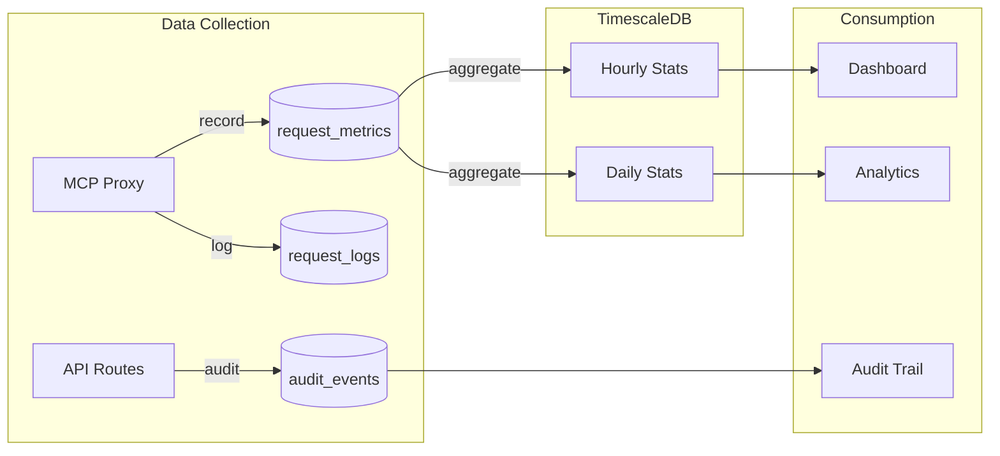
```mermaid
flowchart LR
    subgraph "Data Collection"
        Proxy[MCP Proxy] -->|record| Metrics[(request_metrics)]
        Proxy -->|log| Logs[(request_logs)]
        API[API Routes] -->|audit| Audit[(audit_events)]
    end
    
    subgraph "TimescaleDB"
        Metrics -->|aggregate| Hourly[Hourly Stats]
        Metrics -->|aggregate| Daily[Daily Stats]
    end
    
    subgraph "Consumption"
        Hourly --> Dashboard[Dashboard]
        Daily --> Analytics[Analytics]
        Audit --> Trail[Audit Trail]
    end
```

## Phase 1: Esta Entrega

| Feature | Escopo | Hypertable | Retention |
|---------|--------|------------|-----------|
| **Request Metrics** | Completo | `request_metrics` | 90 days |
| **Server Logs** | Schema only | `request_logs` | 30 days |
| **Audit Trail** | Schema only | `audit_events` | 365 days |

### API Endpoints

| Method | Endpoint | Description |
|--------|----------|-------------|
| `GET` | `/api/metrics/today` | Today's request count by target type |
| `GET` | `/api/metrics/hourly?hours=24` | Hourly breakdown with latency |

### Response Examples

```json
// GET /api/metrics/today
{
  "servers": 142,
  "gateways": 58
}

// GET /api/metrics/hourly?hours=24
[
  { "bucket": "2024-01-15T10:00:00Z", "total": 23, "avg_latency_ms": 145 },
  { "bucket": "2024-01-15T11:00:00Z", "total": 31, "avg_latency_ms": 132 }
]
```

## Phase 2: Próxima Entrega

| Feature | Description |
|---------|-------------|
| **Analytics Dashboard** | Charts, top tools, trends visualization |
| **Rate Limiting** | Time-window counters, blocking middleware |
| **Alerting** | Error spike detection, notifications |

---

**END OF SPEC**

**Questions?** mail.thiagomendes@gmail.com
